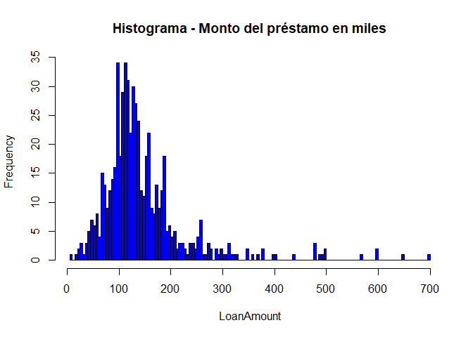
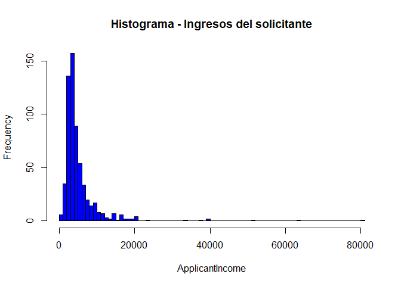
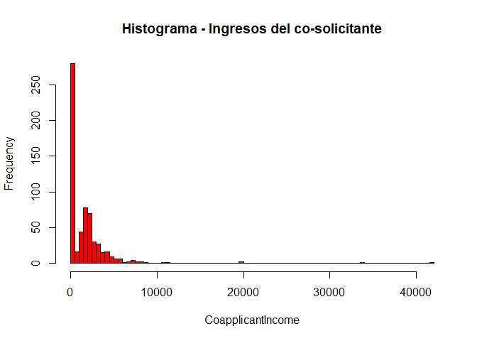
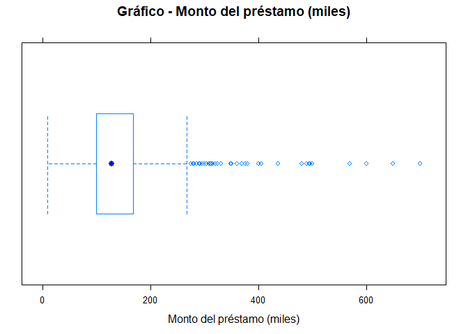
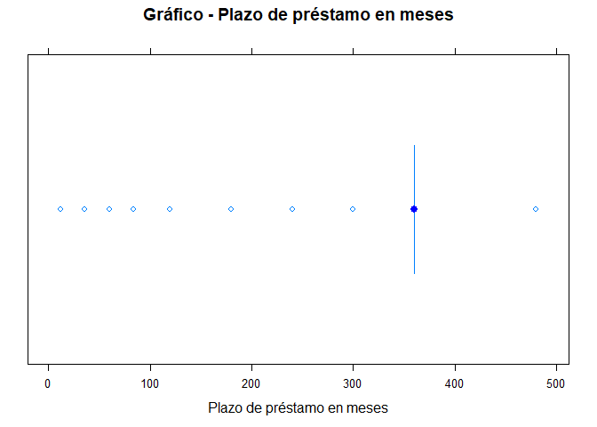
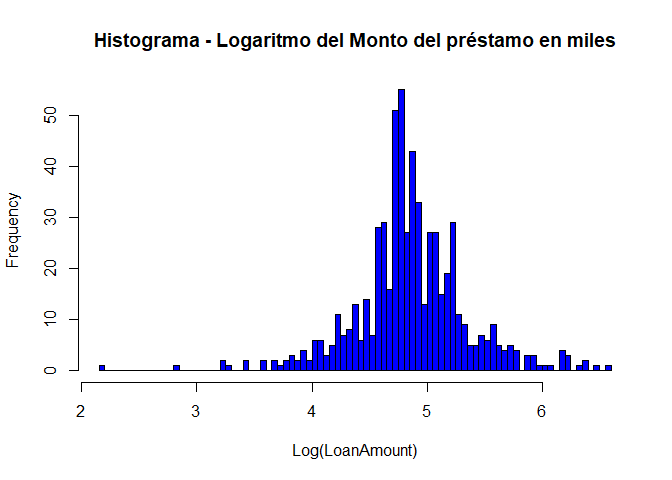
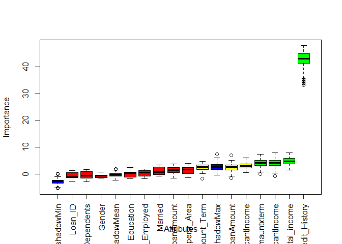

### 1. Planteamiento del problema

La compañía Dream Housing Finance se ocupa de todos los **préstamos hipotecarios**. Tienen presencia en todas las áreas urbanas, semi urbanas y rurales. El cliente primero solicita un préstamo hipotecario luego de que esa compañía valida la elegibilidad del cliente para el préstamo.

-   **Problema:** La empresa desea automatizar el proceso de elegibilidad del préstamo (en tiempo real) según los detalles del cliente proporcionados al completar el formulario de solicitud en línea. Estos detalles son Género, Estado civil, Educación, Número de dependientes, Ingresos, Monto del préstamo, Historial de crédito y otros. Para automatizar este proceso, han dado un problema para identificar los segmentos de clientes, que son elegibles para el monto del préstamo para que puedan dirigirse específicamente a estos clientes. Aquí han proporcionado un conjunto de datos parciales

### 2. Dataset

1.  **Loan\_ID:** ID único de préstamo
2.  **Gender:** Male/ Female
3.  **Married:** Casado? (Y/N)
4.  **Dependents:** Número de dependientes
5.  **Education:** Educación del solicitante (Graduate/ Under Graduate)
6.  **Self\_Employed:** Trabajadores por cuenta propia (Y/N)
7.  **ApplicantIncome:** Ingresos del solicitante
8.  **CoapplicantIncome:** Ingresos del co-solicitante
9.  **LoanAmount:** Monto del préstamo en miles
10. **Loan\_Amount\_Term:** Plazo de préstamo en meses
11. **Credit\_History:** Historial de crédito, cumple con las pautas.
12. **Property\_Area:** Urban/ Semi Urban/ Rural
13. **Loan\_Status:** Préstamo aprobado (Y/N)

### 3. Librerías a utilizar

``` r
library(sqldf)
library(ggvis)
library(party)
library(Boruta)
library(pROC)
library(randomForest)
library(e1071)
library(caret)
library(glmnet)
library(mboost)
library(adabag)
library(xgboost)
library(ROCR)
library(C50)
library(mlr)
library(lattice)
library(gmodels)
library(gplots)
library(DMwR)
library(rminer)
library(polycor)
library(class)
library(neuralnet)
library(knitr)
```

### 4. Leyendo la data

La data ya ha sido separada en 2 partes: train y test. Para el análisis de datos, utilizaremos la data train.csv, y lo leeremos usando el siguiente comando:

``` r
#train <- read.csv("MI - Fundamentos de Machine Learning/DataSet/train.csv",na.strings = c(""," ",NA))
#test<-read.csv("MI - Fundamentos de Machine Learning/DataSet/test.csv",na.strings = c(""," ",NA)) 
```

### 5. Exploración de la data

Corroboremos el nombre de las columnas del dataset según lo otorgado por el cliente.

``` r
features <- as.data.frame(names(train)) 
names(features) <- "Nombre de las columnas"
kable(features)
```

| Nombre de las columnas |
|:-----------------------|
| Loan\_ID               |
| Gender                 |
| Married                |
| Dependents             |
| Education              |
| Self\_Employed         |
| ApplicantIncome        |
| CoapplicantIncome      |
| LoanAmount             |
| Loan\_Amount\_Term     |
| Credit\_History        |
| Property\_Area         |
| Loan\_Status           |

Mostrando los primeros elementos de la data

``` r
kable(as.data.frame(head(train)))
```

| Loan\_ID | Gender | Married | Dependents | Education    | Self\_Employed |  ApplicantIncome|  CoapplicantIncome|  LoanAmount|  Loan\_Amount\_Term|  Credit\_History| Property\_Area | Loan\_Status |
|:---------|:-------|:--------|:-----------|:-------------|:---------------|----------------:|------------------:|-----------:|-------------------:|----------------:|:---------------|:-------------|
| LP001002 | Male   | No      | 0          | Graduate     | No             |             5849|                  0|          NA|                 360|                1| Urban          | Y            |
| LP001003 | Male   | Yes     | 1          | Graduate     | No             |             4583|               1508|         128|                 360|                1| Rural          | N            |
| LP001005 | Male   | Yes     | 0          | Graduate     | Yes            |             3000|                  0|          66|                 360|                1| Urban          | Y            |
| LP001006 | Male   | Yes     | 0          | Not Graduate | No             |             2583|               2358|         120|                 360|                1| Urban          | Y            |
| LP001008 | Male   | No      | 0          | Graduate     | No             |             6000|                  0|         141|                 360|                1| Urban          | Y            |
| LP001011 | Male   | Yes     | 2          | Graduate     | Yes            |             5417|               4196|         267|                 360|                1| Urban          | Y            |

Mostrando los últimos elementos de la data

``` r
kable(as.data.frame(tail(train)))
```

|     | Loan\_ID | Gender | Married | Dependents | Education | Self\_Employed |  ApplicantIncome|  CoapplicantIncome|  LoanAmount|  Loan\_Amount\_Term|  Credit\_History| Property\_Area | Loan\_Status |
|-----|:---------|:-------|:--------|:-----------|:----------|:---------------|----------------:|------------------:|-----------:|-------------------:|----------------:|:---------------|:-------------|
| 609 | LP002974 | Male   | Yes     | 0          | Graduate  | No             |             3232|               1950|         108|                 360|                1| Rural          | Y            |
| 610 | LP002978 | Female | No      | 0          | Graduate  | No             |             2900|                  0|          71|                 360|                1| Rural          | Y            |
| 611 | LP002979 | Male   | Yes     | 3+         | Graduate  | No             |             4106|                  0|          40|                 180|                1| Rural          | Y            |
| 612 | LP002983 | Male   | Yes     | 1          | Graduate  | No             |             8072|                240|         253|                 360|                1| Urban          | Y            |
| 613 | LP002984 | Male   | Yes     | 2          | Graduate  | No             |             7583|                  0|         187|                 360|                1| Urban          | Y            |
| 614 | LP002990 | Female | No      | 0          | Graduate  | Yes            |             4583|                  0|         133|                 360|                0| Semiurban      | N            |

#### Tablas resumen

``` r
resumen=data.frame(summarizeColumns(train))
kable(summarizeColumns(train)) # tabla mas completa
```

| name               | type    |   na|          mean|          disp|  median|        mad|  min|    max|  nlevs|
|:-------------------|:--------|----:|-------------:|-------------:|-------:|----------:|----:|------:|------:|
| Loan\_ID           | factor  |    0|            NA|     0.9983713|      NA|         NA|    1|      1|    614|
| Gender             | factor  |   13|            NA|            NA|      NA|         NA|  112|    489|      2|
| Married            | factor  |    3|            NA|            NA|      NA|         NA|  213|    398|      2|
| Dependents         | factor  |   15|            NA|            NA|      NA|         NA|   51|    345|      4|
| Education          | factor  |    0|            NA|     0.2182410|      NA|         NA|  134|    480|      2|
| Self\_Employed     | factor  |   32|            NA|            NA|      NA|         NA|   82|    500|      2|
| ApplicantIncome    | integer |    0|  5403.4592834|  6109.0416734|  3812.5|  1822.8567|  150|  81000|      0|
| CoapplicantIncome  | numeric |    0|  1621.2457980|  2926.2483692|  1188.5|  1762.0701|    0|  41667|      0|
| LoanAmount         | integer |   22|   146.4121622|    85.5873252|   128.0|    47.4432|    9|    700|      0|
| Loan\_Amount\_Term | integer |   14|   342.0000000|    65.1204099|   360.0|     0.0000|   12|    480|      0|
| Credit\_History    | integer |   50|     0.8421986|     0.3648783|     1.0|     0.0000|    0|      1|      0|
| Property\_Area     | factor  |    0|            NA|     0.6205212|      NA|         NA|  179|    233|      3|
| Loan\_Status       | factor  |    0|            NA|     0.3127036|      NA|         NA|  192|    422|      2|

#### Gráficos

##### LoanAmount

``` r
hist(train$LoanAmount, breaks = 100, main = "Histograma - Monto del préstamo en miles",xlab = "LoanAmount",col="blue")
```



##### ApplicantIncome

``` r
hist(train$ApplicantIncome, breaks = 100, main = "Histograma - Ingresos del solicitante",xlab = "ApplicantIncome",col="blue")
```



##### CoapplicantIncome

``` r
hist(train$CoapplicantIncome, breaks = 100, main = "Histograma - Ingresos del co-solicitante",xlab = "CoapplicantIncome",col="red")
```



#### Visualización de outliers

##### LoanAmount

``` r
bwplot(train$LoanAmount, layout = c(1, 1),main = "Gráfico - Monto del préstamo (miles)",xlab = "Monto del préstamo (miles)", col="blue")
```



##### Loan\_Amount\_Term

``` r
bwplot(train$Loan_Amount_Term, layout = c(1, 1),main = "Gráfico - Plazo de préstamo en meses",xlab = "Plazo de préstamo en meses", col="blue")
```



### Comentarios del analista sobre data faltante

Recordemos los siguientes puntos:

1.  **LoanAmount** tiene 22 valores perdidos.
2.  **Loan\_Amount\_Term** tiene 14 valores perdidos.
3.  **Credit\_History** tiene 50 valores perdidos.
4.  Nosotros podemos también observar que cerca del 84% de los solicitantes al préstamo tienen un historial crediticio. ¿Cómo? La media del campo **Credit\_History** es 0.84 (Recordemos, **Credit\_History** tiene o toma el valor 1 para aquellos que tienen historial crediticio y 0 en caso contrario).
5.  La variable **ApplicantIncome** parece estar en línea con las espectativas al igual que **CoapplicantIncome**.

### 6. Imputación de la data

Revisión de valores perdidos

``` r
perdidos=data.frame(resumen$name,resumen$na,resumen$type)
colnames(perdidos)=c("Característica","Valores faltantes","Tipo de dato")
kable(perdidos)
```

| Característica     |  Valores faltantes| Tipo de dato |
|:-------------------|------------------:|:-------------|
| Loan\_ID           |                  0| factor       |
| Gender             |                 13| factor       |
| Married            |                  3| factor       |
| Dependents         |                 15| factor       |
| Education          |                  0| factor       |
| Self\_Employed     |                 32| factor       |
| ApplicantIncome    |                  0| integer      |
| CoapplicantIncome  |                  0| numeric      |
| LoanAmount         |                 22| integer      |
| Loan\_Amount\_Term |                 14| integer      |
| Credit\_History    |                 50| integer      |
| Property\_Area     |                  0| factor       |
| Loan\_Status       |                  0| factor       |

#### Recodificación de variables

***Para la data train***

Recodificando y cambiando el tipo de dato a factor a la variable **Dependents**

``` r
train$Dependents=ifelse(train$Dependents=="3+",3,
                                 ifelse(train$Dependents=="0",0,
                                        ifelse(train$Dependents=="1",1,
                                               ifelse(train$Dependents=="2",2,
                                                      train$Dependents))))
train$Dependents <- as.factor(train$Dependents)
```

Convirtiendo en factor **Credit\_History**

``` r
train$Credit_History <- as.factor(train$Credit_History)
```

Recodificando **Loan\_Status**

``` r
train$Loan_Status <- ifelse(train$Loan_Status=="N",0,1)
train$Loan_Status <- as.factor(train$Loan_Status)
```

Particionando la data en numéricos y factores

-   **Variables cuantitativas**

``` r
numericos <- sapply(train, is.numeric)
train_numericos <-  train[ , numericos]
```

-   **Variables cualitativas**

``` r
factores <- sapply(train, is.factor) 
train_factores <- train[ , factores]
```

Aplicando la función **lapply** para distintas columnas

``` r
n1=min(dim(train_factores))
train_factores[2:(n1-1)] <- lapply(train_factores[2:(n1-1)], as.numeric)
train_factores[2:(n1-1)] <- lapply(train_factores[2:(n1-1)], as.factor)
```

***Para la data test***

Recodificando y cambiando el tipo de dato a factor a la variable **Dependents**

``` r
test$Dependents=ifelse(test$Dependents=="3+",3,
                        ifelse(test$Dependents=="0",0,
                               ifelse(test$Dependents=="1",1,
                                      ifelse(test$Dependents=="2",2,
                                             test$Dependents))))
test$Dependents=as.factor(test$Dependents)
names(test)
```

    ##  [1] "Loan_ID"           "Gender"            "Married"          
    ##  [4] "Dependents"        "Education"         "Self_Employed"    
    ##  [7] "ApplicantIncome"   "CoapplicantIncome" "LoanAmount"       
    ## [10] "Loan_Amount_Term"  "Credit_History"    "Property_Area"

Convirtiendo en factor **Credit\_History**

``` r
test$Credit_History <- as.factor(test$Credit_History)
```

Particionando la data en numéricos y factores

-   **Variables cuantitativas**

``` r
numericos <- sapply(test, is.numeric)
test_numericos <-  test[ , numericos]
```

-   **Variables cualitativas**

``` r
factores <- sapply(test, is.factor) 
test_factores <- test[ , factores]
```

Aplicando la función **lapply** para distintas columnas

``` r
n1=min(dim(test_factores))
test_factores[2:(n1)] <- lapply(test_factores[2:(n1)], as.numeric)
test_factores[2:(n1)] <- lapply(test_factores[2:(n1)], as.factor)
```

### *Imputación paramétrica*

Podemos imputar los valores perdidos por la media o la moda

***data train***

``` r
train_parametrica <- impute(train, classes = list(factor = imputeMode(), 
                                    integer = imputeMode(),
                                    numeric = imputeMean()),
              dummy.classes = c("integer","factor"), dummy.type = "numeric")
train_parametrica=train_parametrica$data[,1:min(dim(train))]
kable(summarizeColumns(train_parametrica))
```

| name               | type    |   na|       mean|          disp|  median|       mad|  min|    max|  nlevs|
|:-------------------|:--------|----:|----------:|-------------:|-------:|---------:|----:|------:|------:|
| Loan\_ID           | factor  |    0|         NA|     0.9983713|      NA|        NA|    1|      1|    614|
| Gender             | factor  |    0|         NA|     0.1824104|      NA|        NA|  112|    502|      2|
| Married            | factor  |    0|         NA|     0.3469055|      NA|        NA|  213|    401|      2|
| Dependents         | factor  |    0|         NA|     0.4136808|      NA|        NA|   51|    360|      4|
| Education          | factor  |    0|         NA|     0.2182410|      NA|        NA|  134|    480|      2|
| Self\_Employed     | factor  |    0|         NA|     0.1335505|      NA|        NA|   82|    532|      2|
| ApplicantIncome    | numeric |    0|  5403.4593|  6109.0416734|  3812.5|  1822.857|  150|  81000|      0|
| CoapplicantIncome  | numeric |    0|  1621.2458|  2926.2483692|  1188.5|  1762.070|    0|  41667|      0|
| LoanAmount         | numeric |    0|   145.4658|    84.1809670|   125.0|    44.478|    9|    700|      0|
| Loan\_Amount\_Term | numeric |    0|   342.4104|    64.4286291|   360.0|     0.000|   12|    480|      0|
| Credit\_History    | factor  |    0|         NA|     0.1449511|      NA|        NA|   89|    525|      2|
| Property\_Area     | factor  |    0|         NA|     0.6205212|      NA|        NA|  179|    233|      3|
| Loan\_Status       | factor  |    0|         NA|     0.3127036|      NA|        NA|  192|    422|      2|

***data test***

``` r
test_parametrica  <- impute(test, classes = list(factor = imputeMode(), 
                                    integer = imputeMode(),
                                    numeric = imputeMean()), 
               dummy.classes = c("integer","factor"), dummy.type = "numeric")
test_parametrica=test_parametrica$data[,1:min(dim(test))]
```

### 7. Creación y transformación de variables

Ingresos totales = Ingresos del solicitante + Ingresos del co-solicitante

``` r
train_parametrica$Total_income=train_parametrica$ApplicantIncome+train_parametrica$CoapplicantIncome
```

Transformamos el monto del préstamo (en miles) usando logaritmo, esto se hace para corregir su distribución y matar outliers

``` r
train_parametrica$log_LoanAmount=log(train_parametrica$LoanAmount)
str(train_parametrica$log_LoanAmount)
```

    ##  num [1:614] 4.79 4.85 4.19 4.79 4.95 ...

Revisemos ahora su distribución

``` r
hist(train_parametrica$log_LoanAmount, breaks = 100, main = "Histograma - Logaritmo del Monto del préstamo en miles",xlab = "Log(LoanAmount)",col="blue")
```



Ahora la distribución ahora es normal.

Creemos ahora la variable: Monto por term = ingreso total / Monto del préstamo en miles

``` r
train_parametrica$Amauntxterm=train_parametrica$Total_income/train_parametrica$LoanAmount
```

### 8. Balanceo de Datos y Creación de Drivers

#### Particionando la Data

``` r
set.seed(1234)
sample <- createDataPartition(train_parametrica$Loan_Status, p = .70,list = FALSE,times = 1)

data.train <- train_parametrica[ sample,]
data.prueba <- train_parametrica[-sample,]
```

#### Balanceo de los datos

##### **Balanceo mediante UnderSampling**

``` r
table(data.train$Loan_Status)
```

    ## 
    ##   0   1 
    ## 135 296

``` r
menorcero<-subset(data.train,Loan_Status=="0") 
mayoruno<-subset(data.train,Loan_Status=="1")


set.seed(1234)
sample<-sample.int(nrow(mayoruno),nrow(menorcero))
length(sample)
```

    ## [1] 135

``` r
mayoruno.prueba<-mayoruno[sample,]

data.train=rbind(mayoruno.prueba,menorcero)
table(data.train$Loan_Status)
```

    ## 
    ##   0   1 
    ## 135 135

``` r
rm(mayoruno,menorcero,mayoruno.prueba)
```

### 9. Seleccion de variables

#### Mediante Técnicas de Machine Learning

##### Utilizando Boruta

``` r
Boruta(Loan_Status~.,data=data.train,doTrace=2)->Bor.hvo;
plot(Bor.hvo,las=3);
```



``` r
Bor.hvo$finalDecision
```

    ##           Loan_ID            Gender           Married        Dependents 
    ##          Rejected          Rejected          Rejected          Rejected 
    ##         Education     Self_Employed   ApplicantIncome CoapplicantIncome 
    ##          Rejected          Rejected         Confirmed         Tentative 
    ##        LoanAmount  Loan_Amount_Term    Credit_History     Property_Area 
    ##          Rejected         Tentative         Confirmed          Rejected 
    ##      Total_income    log_LoanAmount       Amauntxterm 
    ##         Confirmed         Tentative         Confirmed 
    ## Levels: Tentative Confirmed Rejected

### 10. Modelado de la data

Data de entrenamiento

``` r
data.train.1=subset(data.train,select=c("Credit_History","LoanAmount","Total_income","Amauntxterm" ,"Loan_Status"))
```

Data de validación

``` r
data.test.1=subset(data.prueba,select=c("Credit_History","LoanAmount","Total_income","Amauntxterm" ,"Loan_Status"))
```

m=min(dim(data.train.1)) m

#### **Modelo 1.- Logistico**

``` r
modelo1=glm(Loan_Status~.,data=data.train.1,family = binomial(link = "logit"))
summary(modelo1)
```

    ## 
    ## Call:
    ## glm(formula = Loan_Status ~ ., family = binomial(link = "logit"), 
    ##     data = data.train.1)
    ## 
    ## Deviance Residuals: 
    ##     Min       1Q   Median       3Q      Max  
    ## -1.8701  -1.3160  -0.0161   0.9614   2.5263  
    ## 
    ## Coefficients:
    ##                   Estimate Std. Error z value Pr(>|z|)    
    ## (Intercept)     -3.349e+00  7.566e-01  -4.426 9.62e-06 ***
    ## Credit_History1  3.563e+00  6.117e-01   5.824 5.75e-09 ***
    ## LoanAmount       6.188e-05  3.014e-03   0.021    0.984    
    ## Total_income    -3.001e-05  4.766e-05  -0.630    0.529    
    ## Amauntxterm      1.136e-02  8.175e-03   1.389    0.165    
    ## ---
    ## Signif. codes:  0 '***' 0.001 '**' 0.01 '*' 0.05 '.' 0.1 ' ' 1
    ## 
    ## (Dispersion parameter for binomial family taken to be 1)
    ## 
    ##     Null deviance: 374.30  on 269  degrees of freedom
    ## Residual deviance: 288.28  on 265  degrees of freedom
    ## AIC: 298.28
    ## 
    ## Number of Fisher Scoring iterations: 5

Prediciendo:

``` r
proba1=predict(modelo1, newdata=data.test.1,type="response")
```

Indicadores:

Área bajo la curva - AUC

``` r
AUC1 <- roc(data.test.1$Loan_Status, proba1)
auc_modelo1=AUC1$auc
auc_modelo1
```

    ## Area under the curve: 0.6721

GINI

``` r
gini1 <- 2*(AUC1$auc) -1
gini1
```

    ## [1] 0.3441938

Calcular los valores predichos

``` r
PRED <-predict(modelo1,data.test.1,type="response")
PRED=ifelse(PRED<=0.5,0,1)
PRED=as.factor(PRED)
```

Calcular la matriz de confusión

``` r
tabla=confusionMatrix(PRED,data.test.1$Loan_Status,positive = "1")
tabla
```

    ## Confusion Matrix and Statistics
    ## 
    ##           Reference
    ## Prediction   0   1
    ##          0  21   4
    ##          1  36 122
    ##                                          
    ##                Accuracy : 0.7814         
    ##                  95% CI : (0.7145, 0.839)
    ##     No Information Rate : 0.6885         
    ##     P-Value [Acc > NIR] : 0.003396       
    ##                                          
    ##                   Kappa : 0.3978         
    ##  Mcnemar's Test P-Value : 9.509e-07      
    ##                                          
    ##             Sensitivity : 0.9683         
    ##             Specificity : 0.3684         
    ##          Pos Pred Value : 0.7722         
    ##          Neg Pred Value : 0.8400         
    ##              Prevalence : 0.6885         
    ##          Detection Rate : 0.6667         
    ##    Detection Prevalence : 0.8634         
    ##       Balanced Accuracy : 0.6683         
    ##                                          
    ##        'Positive' Class : 1              
    ## 

Sensibilidad

``` r
Sensitivity1=as.numeric(tabla$byClass[1])
Sensitivity1
```

    ## [1] 0.968254

Precisión

``` r
Accuracy1=tabla$overall[1]
Accuracy1 <- as.numeric(Accuracy1)
```

Calcular el error de mala clasificación

``` r
error1=mean(PRED!=data.test.1$Loan_Status)
error1
```

    ## [1] 0.2185792

Cuadro resumen:

``` r
kable(cbind(auc_modelo1, gini1,  Accuracy1, Sensitivity1, error1))
```

|  auc\_modelo1|      gini1|  Accuracy1|  Sensitivity1|     error1|
|-------------:|----------:|----------:|-------------:|----------:|
|     0.6720969|  0.3441938|  0.7814208|      0.968254|  0.2185792|

#### **Modelo 2.- KNN**

#### Utilizar libreria para ML, tratamiento de la data

``` r
Credit_History=ifelse(data.train.1$Credit_History=="1",1,2)
data.train.2=data.frame(Credit_History,scale(data.train.1[2:4]),data.train.1$Loan_Status)
colnames(data.train.2)=names(data.train.1)
```

``` r
Credit_History=ifelse(data.test.1$Credit_History=="1",1,2)
data.test.2=data.frame(Credit_History,scale(data.test.1[2:4]),data.test.1$Loan_Status)
colnames(data.test.2)=names(data.test.1)
```

``` r
#create a task
trainTask <- makeClassifTask(data = data.train.2,target = "Loan_Status")
testTask <- makeClassifTask(data = data.test.2, target = "Loan_Status")

trainTask <- makeClassifTask(data = data.train.2,target = "Loan_Status", positive = "1")
```

#### **Modelado KNN**

Creamos el clasificador

``` r
set.seed(1234)
knn <- makeLearner("classif.knn",prob = TRUE,k = 10)
```

Entrenamos y predecimos

``` r
qmodel <- train(knn, trainTask)
qpredict <- predict(qmodel, testTask)
```

Calculo de probabilidades

``` r
response=as.numeric(qpredict$data$response[1:183])
response=ifelse(response==2,1,0)
proba2=response
```

**Indicadores**

Área bajo la curva

``` r
# curva ROC
AUC2 <- roc(data.test.1$Loan_Status, proba2) 
auc_modelo2=AUC2$auc
auc_modelo2
```

    ## Area under the curve: 0.675

Gini

``` r
gini2 <- 2*(AUC2$auc) -1
gini2
```

    ## [1] 0.3500418

Calcular los valores predichos

``` r
PRED <-response
```

Calcular la matriz de confusión

``` r
str(PRED)
```

    ##  num [1:183] 1 1 1 1 1 1 0 1 1 1 ...

``` r
str(data.test.1$Loan_Status)
```

    ##  Factor w/ 2 levels "0","1": 1 2 2 2 2 2 1 2 2 2 ...

``` r
tabla=confusionMatrix(as.factor(PRED),data.test.1$Loan_Status,positive = "1")
tabla
```

    ## Confusion Matrix and Statistics
    ## 
    ##           Reference
    ## Prediction   0   1
    ##          0  29  20
    ##          1  28 106
    ##                                           
    ##                Accuracy : 0.7377          
    ##                  95% CI : (0.6677, 0.7998)
    ##     No Information Rate : 0.6885          
    ##     P-Value [Acc > NIR] : 0.08592         
    ##                                           
    ##                   Kappa : 0.364           
    ##  Mcnemar's Test P-Value : 0.31232         
    ##                                           
    ##             Sensitivity : 0.8413          
    ##             Specificity : 0.5088          
    ##          Pos Pred Value : 0.7910          
    ##          Neg Pred Value : 0.5918          
    ##              Prevalence : 0.6885          
    ##          Detection Rate : 0.5792          
    ##    Detection Prevalence : 0.7322          
    ##       Balanced Accuracy : 0.6750          
    ##                                           
    ##        'Positive' Class : 1               
    ## 

Sensibilidad

``` r
Sensitivity2=as.numeric(tabla$byClass[1])
Sensitivity2
```

    ## [1] 0.8412698

Precisión

``` r
Accuracy2=tabla$overall[1]
Accuracy2
```

    ##  Accuracy 
    ## 0.7377049

Calcular el error de mala clasificación

``` r
error2=mean(PRED!=data.test.1$Loan_Status)
error2
```

    ## [1] 0.2622951

Indicadores

``` r
auc_modelo2
```

    ## Area under the curve: 0.675

``` r
gini2
```

    ## [1] 0.3500418

``` r
Accuracy2
```

    ##  Accuracy 
    ## 0.7377049

``` r
error2
```

    ## [1] 0.2622951

``` r
Sensitivity2
```

    ## [1] 0.8412698

Tabla De Resultados

``` r
AUC=rbind(auc_modelo1,
          auc_modelo2)

GINI=rbind(gini1,
           gini2)

Accuracy=rbind(Accuracy1,
            Accuracy2)

ERROR= rbind(error1,
             error2)

SENSIBILIDAD=rbind(Sensitivity1,
                   Sensitivity2)

resultado=data.frame(AUC,GINI,Accuracy,ERROR,SENSIBILIDAD)
rownames(resultado)=c('Logistico',
                      'KNN')

resultado=round(resultado,2)
kable(resultado)
```

|           |   AUC|  GINI|  Accuracy|  ERROR|  SENSIBILIDAD|
|-----------|-----:|-----:|---------:|------:|-------------:|
| Logistico |  0.67|  0.34|      0.78|   0.22|          0.97|
| KNN       |  0.68|  0.35|      0.74|   0.26|          0.84|

Resultado Ordenado

Ordenamos por el Indicador que deseamos, quiza Accuracy en forma decreciente

``` r
Resultado_ordenado <- resultado[order(-Accuracy),] 
kable(Resultado_ordenado)
```

|           |   AUC|  GINI|  Accuracy|  ERROR|  SENSIBILIDAD|
|-----------|-----:|-----:|---------:|------:|-------------:|
| Logistico |  0.67|  0.34|      0.78|   0.22|          0.97|
| KNN       |  0.68|  0.35|      0.74|   0.26|          0.84|
