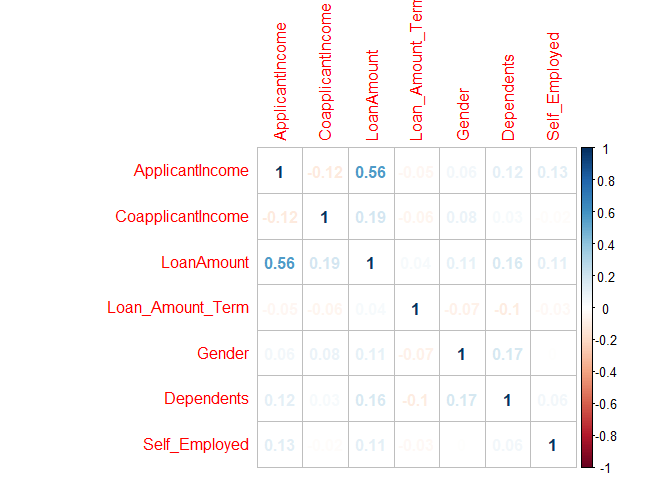

### 1). Librerías a utilizar

``` r
library("readxl")
library("ggplot2")
library(glmnet)
library(gee)
library(readxl)
library(leaps)
library(dplyr)
library(caret)
library(pROC)
library(corrplot)
library(knitr)
```

### 2). Modelo de Regresión Logística

#### Cargar la data (limpia)

``` r
Train=read.csv("H:/Programa de Especialización - Data Science - Anthony Manosalva/R_Python/Modulo III_Clasificacion_Regresion_Logistica_Binaria/DataSet/train_t.csv")
```

Pasamos a factor la variable target, así:

``` r
Train$Loan_Status = as.factor(Train$Loan_Status)
```

Observar aleatoriamente 3 valores de la data:

``` r
sample_n(Train, 3)
```

    ##     Loan_Status ApplicantIncome CoapplicantIncome LoanAmount
    ## 611           1            4106                 0         40
    ## 220           1            4283              2383        127
    ## 430           1            2717                 0         60
    ##     Loan_Amount_Term Gender Dependents Self_Employed Credit_History
    ## 611              180      2          4             1              2
    ## 220              360      1          3             1              2
    ## 430              180      2          1             1              2
    ##     Total_income log_LoanAmount Amauntxterm Property_Area Edu_Ma
    ## 611         4106       3.688879   102.65000             1      3
    ## 220         6666       4.844187    52.48819             2      3
    ## 430         2717       4.094345    45.28333             1      1

#### Supuestos

Por defecto utiliza *pearson*, en caso de querer *spearman* o *kendall*, agregar el parámetro *method* y asignar el método deseado.

``` r
cor(Train[,2:8])
```

    ##                   ApplicantIncome CoapplicantIncome LoanAmount
    ## ApplicantIncome        1.00000000       -0.11660458 0.56469817
    ## CoapplicantIncome     -0.11660458        1.00000000 0.18972284
    ## LoanAmount             0.56469817        0.18972284 1.00000000
    ## Loan_Amount_Term      -0.04653112       -0.05938309 0.03715174
    ## Gender                 0.05880898        0.08291207 0.10640431
    ## Dependents             0.11820186        0.03042997 0.16301741
    ## Self_Employed          0.12717953       -0.01610011 0.11497056
    ##                   Loan_Amount_Term        Gender  Dependents Self_Employed
    ## ApplicantIncome        -0.04653112  0.0588089797  0.11820186  0.1271795341
    ## CoapplicantIncome      -0.05938309  0.0829120711  0.03042997 -0.0161001068
    ## LoanAmount              0.03715174  0.1064043082  0.16301741  0.1149705593
    ## Loan_Amount_Term        1.00000000 -0.0740295570 -0.10386412 -0.0337394309
    ## Gender                 -0.07402956  1.0000000000  0.17291418 -0.0005249884
    ## Dependents             -0.10386412  0.1729141847  1.00000000  0.0567979391
    ## Self_Employed          -0.03373943 -0.0005249884  0.05679794  1.0000000000

``` r
corrplot(cor(Train[,2:8]), method = "number")
```



#### Particion Muestral

Obs: *%&gt;%* "Aplícalo en tal"

``` r
set.seed(123)
training.samples <- Train$Loan_Status %>% 
  createDataPartition(p = 0.8, list = FALSE)
train.data  <- Train[training.samples, ]
test.data <- Train[-training.samples, ]
```

#### ¿La data está balanceada?

``` r
table(train.data$Loan_Status)
```

    ## 
    ##   0   1 
    ## 154 338

La data no está balanceada.

#### Modelado

*Comentario del SBS:* SBS: TODAS LAS VARIABLES SIGNIFICATIVAS PARA QUE LAS VARIABLES SEAN ESTABLES EN EL TIEMPO, POR AHORA NO TOMAREMOS ESO EN CUENTA.

``` r
modelo_logistica=glm(Loan_Status~.,data=train.data,family="binomial" )
summary(modelo_logistica)
```

    ## 
    ## Call:
    ## glm(formula = Loan_Status ~ ., family = "binomial", data = train.data)
    ## 
    ## Deviance Residuals: 
    ##     Min       1Q   Median       3Q      Max  
    ## -2.2219  -0.3780   0.5624   0.7220   2.4083  
    ## 
    ## Coefficients: (1 not defined because of singularities)
    ##                     Estimate Std. Error z value Pr(>|z|)    
    ## (Intercept)       -8.540e+00  2.757e+00  -3.098  0.00195 ** 
    ## ApplicantIncome    2.123e-05  3.492e-05   0.608  0.54321    
    ## CoapplicantIncome -2.605e-05  5.135e-05  -0.507  0.61193    
    ## LoanAmount        -2.013e-03  3.353e-03  -0.600  0.54828    
    ## Loan_Amount_Term  -1.042e-03  2.000e-03  -0.521  0.60249    
    ## Gender             3.323e-02  3.150e-01   0.105  0.91598    
    ## Dependents         1.140e-01  1.249e-01   0.913  0.36144    
    ## Self_Employed      6.044e-02  3.474e-01   0.174  0.86189    
    ## Credit_History     3.813e+00  4.625e-01   8.246  < 2e-16 ***
    ## Total_income              NA         NA      NA       NA    
    ## log_LoanAmount     1.707e-01  6.015e-01   0.284  0.77661    
    ## Amauntxterm       -4.395e-04  5.589e-03  -0.079  0.93732    
    ## Property_Area      7.256e-01  2.589e-01   2.802  0.00507 ** 
    ## Edu_Ma             3.174e-01  1.529e-01   2.076  0.03787 *  
    ## ---
    ## Signif. codes:  0 '***' 0.001 '**' 0.01 '*' 0.05 '.' 0.1 ' ' 1
    ## 
    ## (Dispersion parameter for binomial family taken to be 1)
    ## 
    ##     Null deviance: 611.54  on 491  degrees of freedom
    ## Residual deviance: 458.69  on 479  degrees of freedom
    ## AIC: 484.69
    ## 
    ## Number of Fisher Scoring iterations: 5

#### Indicadores

Usando la data test: *test.data*

``` r
proba1=predict(modelo_logistica, newdata=test.data,type="response")
```

    ## Warning in predict.lm(object, newdata, se.fit, scale = 1, type =
    ## ifelse(type == : prediction from a rank-deficient fit may be misleading

##### Área bajo la curva: *AUC1*

``` r
AUC1 <- roc(test.data$Loan_Status, proba1)
auc_modelo1=AUC1$auc
auc_modelo1
```

    ## Area under the curve: 0.807

##### GINI:

``` r
gini1 <- 2*(AUC1$auc) -1
gini1
```

    ## [1] 0.6140351

*Calcular los valores predichos:*

``` r
PRED <-predict(modelo_logistica,test.data,type="response")
```

    ## Warning in predict.lm(object, newdata, se.fit, scale = 1, type =
    ## ifelse(type == : prediction from a rank-deficient fit may be misleading

``` r
#PRED=ifelse(PRED<=0.5,0,1  )  #Aquí cambiamos el valor predicho.
PRED=ifelse(PRED<=0.31,0,1)
PRED=as.factor(PRED)
```

##### Matriz de confusión

``` r
tabla=confusionMatrix(PRED,test.data$Loan_Status,positive = "1")
tabla
```

    ## Confusion Matrix and Statistics
    ## 
    ##           Reference
    ## Prediction  0  1
    ##          0 17  1
    ##          1 21 83
    ##                                           
    ##                Accuracy : 0.8197          
    ##                  95% CI : (0.7398, 0.8834)
    ##     No Information Rate : 0.6885          
    ##     P-Value [Acc > NIR] : 0.000775        
    ##                                           
    ##                   Kappa : 0.5088          
    ##  Mcnemar's Test P-Value : 5.104e-05       
    ##                                           
    ##             Sensitivity : 0.9881          
    ##             Specificity : 0.4474          
    ##          Pos Pred Value : 0.7981          
    ##          Neg Pred Value : 0.9444          
    ##              Prevalence : 0.6885          
    ##          Detection Rate : 0.6803          
    ##    Detection Prevalence : 0.8525          
    ##       Balanced Accuracy : 0.7177          
    ##                                           
    ##        'Positive' Class : 1               
    ## 

*Sensibilidad*

``` r
Sensitivity1=as.numeric(tabla$byClass[1])
Sensitivity1
```

    ## [1] 0.9880952

*Precisión*

``` r
Accuracy1=tabla$overall[1]
Accuracy1
```

    ##  Accuracy 
    ## 0.8196721

*Calcular el error de mala clasificación*

``` r
error1=mean(PRED!=test.data$Loan_Status)
```

*Todos los indicadores:*

``` r
cbind(auc_modelo1, gini1, Sensitivity1, Accuracy1, error1)
```

    ##          auc_modelo1     gini1 Sensitivity1 Accuracy1    error1
    ## Accuracy   0.8070175 0.6140351    0.9880952 0.8196721 0.1803279

**Falta parte de las clase**
