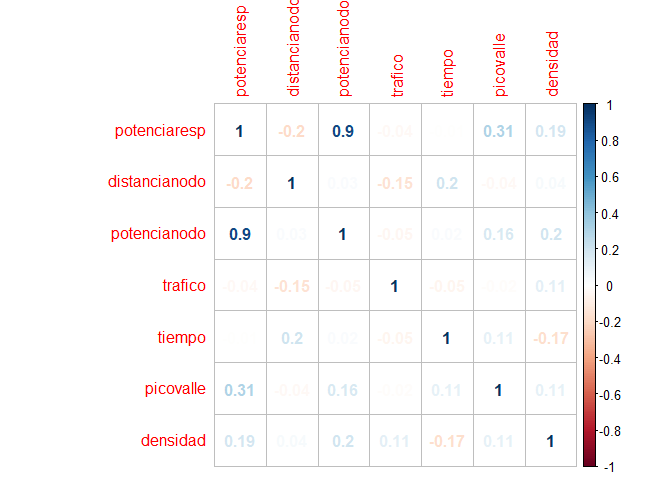
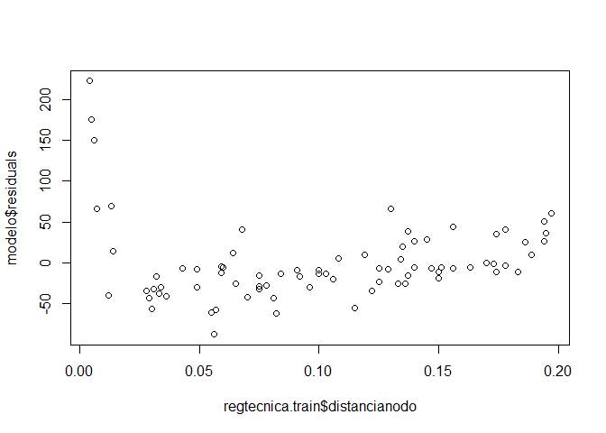
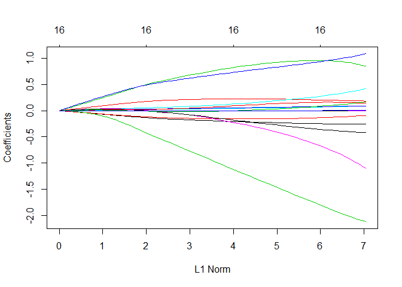
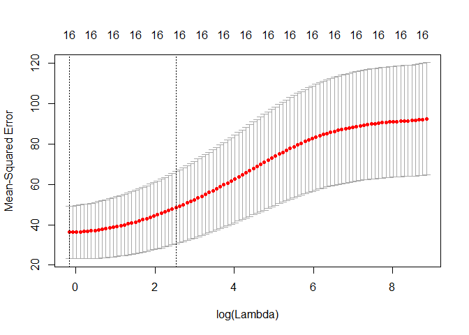
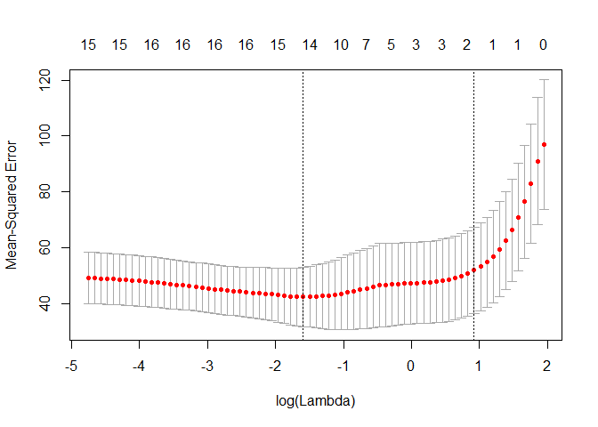
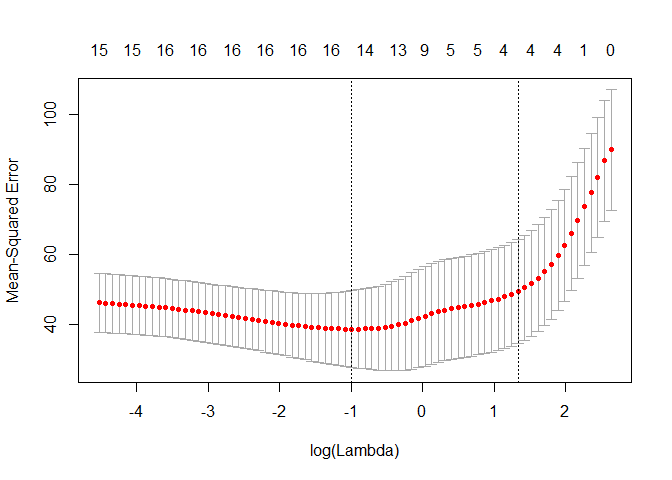

### 1. Librerías a usar

Tomar en cuenta que para regresiones penalizadas, necesitamos que los datos estén en forma de matriz. Además, todos los datos tienen que ser numéricos. Esta es la restricción que nos proporciona la librería **glmnet**

``` r
library("readxl")
#library("ggplot2")
library(glmnet)
library(gee)
library(readxl)
library(leaps)
library(corrplot)
library(knitr)
library(mlr)
```

### 2. Modelo de regresión lineal

#### Carga de la data

``` r
setwd("H:/Programa de Especialización - Data Science - Anthony Manosalva/R_Python/Modulo_II_ Modelos_de_Regresión_Avanzados/DataSet")
regtecnica=read.csv("regtecnica.csv",header=T,sep=";",dec=",")
```

#### Descripción de la data

``` r
kable(summarizeColumns(regtecnica))
```

| name          | type    |   na|          mean|          disp|    median|           mad|      min|       max|  nlevs|
|:--------------|:--------|----:|-------------:|-------------:|---------:|-------------:|--------:|---------:|------:|
| potenciaresp  | numeric |    0|   571.2553030|   169.5382789|   578.230|   186.2946204|  255.123|   949.529|      0|
| distancianodo | numeric |    0|     0.0975455|     0.0569544|     0.096|     0.0696822|    0.003|     0.197|      0|
| potencianodo  | numeric |    0|     2.4985859|     1.4263812|     2.610|     1.8532500|    0.030|     4.970|      0|
| trafico       | integer |    0|  2641.4848485|  1456.2431351|  2690.000|  1810.2546000|   14.000|  4999.000|      0|
| tiempo        | integer |    0|   221.8282828|   115.9312816|   221.000|   146.7774000|    9.000|   400.000|      0|
| picovalle     | integer |    0|     0.5555556|     0.4994328|     1.000|     0.0000000|    0.000|     1.000|      0|
| densidad      | numeric |    0|     5.4854545|     2.9766850|     5.910|     4.1068020|    0.220|     9.860|      0|

#### Partición muestral

Dividimos la data en proporción a 0.8 - 0.2. Esta forma de dividir solo es eficiente para dataset con un target numérico. Para el caso de clasificación se usará otra sentencia que se verá más adelante.

``` r
set.seed(1234) 
sample <- sample.int(nrow(regtecnica), round(.8*nrow(regtecnica)))
regtecnica.train<- regtecnica[sample, ]
regtecnica.valid <- regtecnica[-sample, ]
```

#### Supuestos

Se considera que una variable tiene correlación alta respecto a otra cuando este factor da mayor a 0.6

``` r
corrplot(cor(regtecnica), method = "number")
```



#### Primer modelo para regresión lineal simple

``` r
modelo=lm(potenciaresp~.,data=regtecnica.train)
summary(modelo)
```

    ## 
    ## Call:
    ## lm(formula = potenciaresp ~ ., data = regtecnica.train)
    ## 
    ## Residuals:
    ##     Min      1Q  Median      3Q     Max 
    ## -87.580 -27.865  -8.989  13.396 222.570 
    ## 
    ## Coefficients:
    ##                 Estimate Std. Error t value Pr(>|t|)    
    ## (Intercept)    3.492e+02  2.263e+01  15.431  < 2e-16 ***
    ## distancianodo -5.586e+02  1.088e+02  -5.135 2.31e-06 ***
    ## potencianodo   1.042e+02  4.231e+00  24.632  < 2e-16 ***
    ## trafico       -2.776e-03  3.822e-03  -0.726  0.47008    
    ## tiempo        -3.092e-02  5.255e-02  -0.588  0.55816    
    ## picovalle      4.753e+01  1.168e+01   4.068  0.00012 ***
    ## densidad       2.680e-01  1.971e+00   0.136  0.89220    
    ## ---
    ## Signif. codes:  0 '***' 0.001 '**' 0.01 '*' 0.05 '.' 0.1 ' ' 1
    ## 
    ## Residual standard error: 50.73 on 72 degrees of freedom
    ## Multiple R-squared:  0.9137, Adjusted R-squared:  0.9065 
    ## F-statistic: 127.1 on 6 and 72 DF,  p-value: < 2.2e-16

Tráfico, tiempo, densidad son variables que no son significativas

El **R cuadrado ajustado** le quita el número de variables, el cual a más cantidad inflaría el R cuadrado normal. Para comparar modelos se usará el R cuadrado ajustado y si se quiere interpretar sería el R cuadrado normal.

#### Coeficientes del modelo

``` r
modelo$coefficients
```

    ##   (Intercept) distancianodo  potencianodo       trafico        tiempo 
    ##  349.22970231 -558.55166503  104.21713040   -0.00277550   -0.03091745 
    ##     picovalle      densidad 
    ##   47.52685339    0.26804564

Correlación entre lo predecido y el original: Mientras más cercano a 1, nuestra predicción habrá sido mejor.

``` r
predlm=predict(modelo,regtecnica.valid)
cor(predlm,regtecnica.valid$potenciaresp)
```

    ## [1] 0.8959161

Nuestra predicción fue buena.

#### Indicadores

**Suma de los cuadrados debido al error (SSE)**

``` r
sse=sum((predlm-regtecnica.valid$potenciaresp)^2)
sse
```

    ## [1] 124171.3

**Error cuadrático medio**

Este es el indicador que usaremos para comparar con otros modelos de regresión lineal.

``` r
regressionmse=sqrt(mean((predlm-regtecnica.valid$potenciaresp)^2))
regressionmse
```

    ## [1] 78.79445

Este indicador se basa en algoritmos

``` r
AIC(modelo)
```

    ## [1] 853.2622

El siguiente gráfico debe tener un comportamiento aleatorio. En este caso se ve una tendencia lineal así que probablemente nuestro modelo no está absorviendo algunas relaciones lineales.

``` r
plot(regtecnica.train$distancianodo,modelo$residuals)
```



### 3. Modelo de regresión penalizado - Ridge

#### Carga de datos carros

``` r
setwd("H:/Programa de Especialización - Data Science - Anthony Manosalva/R_Python/Modulo_II_ Modelos_de_Regresión_Avanzados/DataSet")
carros=read_excel("carros2011imputado2.xlsx")
```

#### Descripción de la data

``` r
kable(summarizeColumns(carros))
```

| name                          | type      |   na|         mean|         disp|  median|        mad|         min|     max|  nlevs|
|:------------------------------|:----------|----:|------------:|------------:|-------:|----------:|-----------:|-------:|------:|
| ID                            | numeric   |    0|    47.000000|   26.9907392|    47.0|   34.09980|     1.00000|    93.0|      0|
| millas\_por\_galon\_ciudad    | numeric   |    0|    22.365591|    5.6198115|    21.0|    4.44780|    15.00000|    46.0|      0|
| millas\_por\_galon\_carretera | numeric   |    0|    29.086022|    5.3317260|    28.0|    4.44780|    20.00000|    50.0|      0|
| cilindros                     | numeric   |    0|     4.956989|    1.3014539|     4.0|    0.00000|     3.00000|     8.0|      0|
| litros\_motor                 | numeric   |    0|     2.667742|    1.0373630|     2.4|    0.88956|     1.00000|     5.7|      0|
| caballos\_fuerza              | numeric   |    0|   143.827957|   52.3744095|   140.0|   44.47800|    55.00000|   300.0|      0|
| revoluciones\_por\_minuto     | numeric   |    0|  5280.645161|  596.7316899|  5200.0|  593.04000|  3800.00000|  6500.0|      0|
| rev\_motor\_por\_milla        | numeric   |    0|  2332.204301|  496.5065252|  2340.0|  407.71500|  1320.00000|  3755.0|      0|
| capacidad\_tanque             | numeric   |    0|    16.664516|    3.2793705|    16.4|    3.11346|     9.20000|    27.0|      0|
| capacidad\_pasajeros          | numeric   |    0|     5.086022|    1.0389785|     5.0|    1.48260|     2.00000|     8.0|      0|
| longitud                      | numeric   |    0|   183.204301|   14.6023815|   183.0|   13.34340|   141.00000|   219.0|      0|
| distancia\_entre\_ruedas      | numeric   |    0|   103.946237|    6.8196736|   103.0|    7.41300|    90.00000|   119.0|      0|
| ancho                         | numeric   |    0|    69.376344|    3.7789865|    69.0|    4.44780|    60.00000|    78.0|      0|
| espacio\_para\_dar\_la\_u     | numeric   |    0|    38.956989|    3.2232645|    39.0|    2.96520|    32.00000|    45.0|      0|
| espacio\_asiento\_trasero     | numeric   |    0|    27.683867|    3.1537080|    27.5|    2.96520|    17.81295|    36.0|      0|
| capacidad\_baul               | numeric   |    0|    14.017505|    3.1484991|    14.0|    2.96520|     6.00000|    22.0|      0|
| peso\_en\_libras              | numeric   |    0|  3072.903226|  589.8965102|  3040.0|  704.23500|  1695.00000|  4105.0|      0|
| precio\_promedio              | numeric   |    0|    19.509677|    9.6594296|    17.7|    8.30256|     7.40000|    61.9|      0|
| fabricante                    | character |    0|           NA|    0.9139785|      NA|         NA|     1.00000|     8.0|     32|
| modelo                        | character |    0|           NA|    0.9892473|      NA|         NA|     1.00000|     1.0|     93|
| tipo                          | character |    0|           NA|    0.7634409|      NA|         NA|     9.00000|    22.0|      6|
| numero\_de\_airbags           | character |    0|           NA|    0.5376344|      NA|         NA|    16.00000|    43.0|      3|
| tracción                      | character |    0|           NA|    0.2795699|      NA|         NA|    10.00000|    67.0|      3|
| transmisión\_manual           | character |    0|           NA|    0.3440860|      NA|         NA|    32.00000|    61.0|      2|
| hecho\_o\_no\_en\_USA         | character |    0|           NA|    0.4838710|      NA|         NA|    45.00000|    48.0|      2|

#### Particion Muestral

``` r
set.seed(1234) 
sample <- sample.int(nrow(carros), round(.8*nrow(carros)))
carros.train<- carros[sample, ]
carros.validation <- carros[-sample, ]
```

Necesitamos que la data de la variable predecida y la data de los predictores estén en forma de matriz. (Para la data de entrenamiento y test).

``` r
precio.train=as.matrix(carros.train$precio_promedio)
predictores.train=as.matrix(carros.train[,2:17])

precio.validation=as.matrix(carros.validation$precio_promedio)
predictores.validation=as.matrix(carros.validation[,2:17])
```

#### Modelado

Considerar lo siguiente: **alpha=0** indica que se usará la regresión **Ridge**, <br> **alpha=1** indica que se usara la regresión **Lasso**, <br> **alpha=0.5** indica que se usará la regresión **elastic net**

Las q se alejan mas son las mas importantes

``` r
fitridge=glmnet(predictores.train,precio.train,alpha=0)
fitridge$beta
```

    ## 16 x 100 sparse Matrix of class "dgCMatrix"
    ##                                                                     
    ## millas_por_galon_ciudad    -1.184094e-36 -1.727270e-03 -1.893557e-03
    ## millas_por_galon_carretera -1.106989e-36 -1.614383e-03 -1.769760e-03
    ## cilindros                   4.373751e-36  6.379376e-03  6.993463e-03
    ## litros_motor                5.200227e-36  7.573218e-03  8.300995e-03
    ## caballos_fuerza             1.408287e-37  2.061863e-04  2.261176e-04
    ## revoluciones_por_minuto    -1.018032e-40 -6.629880e-08 -6.392226e-08
    ## rev_motor_por_milla        -7.326897e-39 -1.062862e-05 -1.164558e-05
    ## capacidad_tanque            1.743030e-36  2.540632e-03  2.785025e-03
    ## capacidad_pasajeros        -2.570016e-37 -4.224382e-04 -4.681685e-04
    ## longitud                    3.131837e-37  4.558372e-04  4.996165e-04
    ## distancia_entre_ruedas      6.102484e-37  8.872130e-04  9.723166e-04
    ## ancho                       1.021965e-36  1.480832e-03  1.622346e-03
    ## espacio_para_dar_la_u       9.619039e-37  1.392056e-03  1.524900e-03
    ## espacio_asiento_trasero     4.649865e-37  6.708037e-04  7.345947e-04
    ## capacidad_baul              5.942866e-37  8.550751e-04  9.361456e-04
    ## peso_en_libras              1.003243e-38  1.461640e-05  1.602171e-05
    ##                                                                     
    ## millas_por_galon_ciudad    -2.075641e-03 -2.274970e-03 -2.493121e-03
    ## millas_por_galon_carretera -1.939889e-03 -2.126117e-03 -2.329920e-03
    ## cilindros                   7.665866e-03  8.401928e-03  9.207479e-03
    ## litros_motor                9.097629e-03  9.969384e-03  1.092308e-02
    ## caballos_fuerza             2.479579e-04  2.718861e-04  2.980975e-04
    ## revoluciones_por_minuto    -5.956872e-08 -5.267343e-08 -4.257059e-08
    ## rev_motor_por_milla        -1.275784e-05 -1.397390e-05 -1.530294e-05
    ## capacidad_tanque            3.052584e-03  3.345431e-03  3.665872e-03
    ## capacidad_pasajeros        -5.192588e-04 -5.764183e-04 -6.404534e-04
    ## longitud                    5.475314e-04  5.999579e-04  6.573044e-04
    ## distancia_entre_ruedas      1.065437e-03  1.167301e-03  1.278693e-03
    ## ancho                       1.777082e-03  1.946214e-03  2.131008e-03
    ## espacio_para_dar_la_u       1.670117e-03  1.828799e-03  2.002121e-03
    ## espacio_asiento_trasero     8.042824e-04  8.803777e-04  9.634288e-04
    ## capacidad_baul              1.024659e-03  1.121251e-03  1.226598e-03
    ## peso_en_libras              1.756006e-05  1.924364e-05  2.108564e-05
    ##                                                                     
    ## millas_por_galon_ciudad    -2.731811e-03 -2.992896e-03 -3.278387e-03
    ## millas_por_galon_carretera -2.552894e-03 -2.796771e-03 -3.063423e-03
    ## cilindros                   1.008884e-02  1.105287e-02  1.210698e-02
    ## litros_motor                1.196609e-02  1.310641e-02  1.435266e-02
    ## caballos_fuerza             3.268050e-04  3.582400e-04  3.926544e-04
    ## revoluciones_por_minuto    -2.844868e-08 -9.321195e-09  1.600810e-08
    ## rev_motor_por_milla        -1.675490e-05 -1.834042e-05 -2.007097e-05
    ## capacidad_tanque            4.016409e-03  4.399749e-03  4.818820e-03
    ## capacidad_pasajeros        -7.122903e-04 -7.929945e-04 -8.837936e-04
    ## longitud                    7.200124e-04  7.885597e-04  8.634613e-04
    ## distancia_entre_ruedas      1.400462e-03  1.533525e-03  1.678871e-03
    ## ancho                       2.332829e-03  2.553141e-03  2.793512e-03
    ## espacio_para_dar_la_u       2.191346e-03  2.397828e-03  2.623015e-03
    ## espacio_asiento_trasero     1.054023e-03  1.152787e-03  1.260387e-03
    ## capacidad_baul              1.341425e-03  1.466500e-03  1.602637e-03
    ## peso_en_libras              2.310040e-05  2.530340e-05  2.771139e-05
    ##                                                                     
    ## millas_por_galon_ciudad    -3.590457e-03 -3.931452e-03 -4.303900e-03
    ## millas_por_galon_carretera -3.354875e-03 -3.673309e-03 -4.021076e-03
    ## cilindros                   1.325919e-02  1.451814e-02  1.589316e-02
    ## litros_motor                1.571414e-02  1.720086e-02  1.882357e-02
    ## caballos_fuerza             4.303217e-04  4.715390e-04  5.166284e-04
    ## revoluciones_por_minuto     4.898643e-08  9.136073e-08  1.452351e-07
    ## rev_motor_por_milla        -2.195880e-05 -2.401702e-05 -2.625960e-05
    ## capacidad_tanque            5.276782e-03  5.777044e-03  6.323271e-03
    ## capacidad_pasajeros        -9.861035e-04 -1.101559e-03 -1.232050e-03
    ## longitud                    9.452727e-04  1.034591e-03  1.132056e-03
    ## distancia_entre_ruedas      1.837560e-03  2.010735e-03  2.199614e-03
    ## ancho                       3.055621e-03  3.341257e-03  3.652318e-03
    ## espacio_para_dar_la_u       2.868452e-03  3.135782e-03  3.426742e-03
    ## espacio_asiento_trasero     1.377533e-03  1.504969e-03  1.643485e-03
    ## capacidad_baul              1.750695e-03  1.911573e-03  2.086211e-03
    ## peso_en_libras              3.034242e-05  3.321596e-05  3.635293e-05
    ##                                                                     
    ## millas_por_galon_ciudad    -4.710519e-03 -5.154228e-03 -5.638152e-03
    ## millas_por_galon_carretera -4.400706e-03 -4.814909e-03 -5.266589e-03
    ## cilindros                   1.739427e-02  1.903222e-02  2.081852e-02
    ## litros_motor                2.059379e-02  2.252385e-02  2.462689e-02
    ## caballos_fuerza             5.659390e-04  6.198483e-04  6.787643e-04
    ## revoluciones_por_minuto     2.131386e-07  2.981045e-07  4.037632e-07
    ## rev_motor_por_milla        -2.870135e-05 -3.135794e-05 -3.424590e-05
    ## capacidad_tanque            6.919402e-03  7.569657e-03  8.278546e-03
    ## capacidad_pasajeros        -1.379763e-03 -1.547226e-03 -1.737372e-03
    ## longitud                    1.238355e-03  1.354221e-03  1.480434e-03
    ## distancia_entre_ruedas      2.405504e-03  2.629792e-03  2.873954e-03
    ## ancho                       3.990817e-03  4.358872e-03  4.758708e-03
    ## espacio_para_dar_la_u       3.743168e-03  4.086986e-03  4.460207e-03
    ## espacio_asiento_trasero     1.793901e-03  1.957074e-03  2.133888e-03
    ## capacidad_baul              2.275580e-03  2.480680e-03  2.702529e-03
    ## peso_en_libras              3.977577e-05  4.350852e-05  4.757684e-05
    ##                                                                     
    ## millas_por_galon_ciudad    -6.166001e-03 -6.740706e-03 -7.366342e-03
    ## millas_por_galon_carretera -5.759114e-03 -6.295327e-03 -6.878944e-03
    ## cilindros                   2.276647e-02  2.488751e-02  2.719634e-02
    ## litros_motor                2.691789e-02  2.940996e-02  3.211953e-02
    ## caballos_fuerza             7.431356e-04  8.134225e-04  8.901415e-04
    ## revoluciones_por_minuto     5.336177e-07  6.942558e-07  8.911641e-07
    ## rev_motor_por_milla        -3.738350e-05 -4.078713e-05 -4.447625e-05
    ## capacidad_tanque            9.051006e-03  9.891935e-03  1.080685e-02
    ## capacidad_pasajeros        -1.953337e-03 -2.199493e-03 -2.480192e-03
    ## longitud                    1.617840e-03  1.767286e-03  1.929712e-03
    ## distancia_entre_ruedas      3.139571e-03  3.428253e-03  3.741744e-03
    ## ancho                       5.192657e-03  5.663102e-03  6.172529e-03
    ## espacio_para_dar_la_u       4.864917e-03  5.303265e-03  5.777444e-03
    ## espacio_asiento_trasero     2.325249e-03  2.532076e-03  2.755290e-03
    ## capacidad_baul              2.942141e-03  3.200546e-03  3.478725e-03
    ## peso_en_libras              5.200800e-05  5.683111e-05  6.207683e-05
    ##                                                                     
    ## millas_por_galon_ciudad    -8.046922e-03 -8.786687e-03 -9.590097e-03
    ## millas_por_galon_carretera -7.513678e-03 -8.203446e-03 -8.952361e-03
    ## cilindros                   2.970774e-02  3.243729e-02  3.540140e-02
    ## litros_motor                3.506309e-02  3.825789e-02  4.172194e-02
    ## caballos_fuerza             9.738408e-04  1.065108e-03  1.164570e-03
    ## revoluciones_por_minuto     1.131613e-06  1.424203e-06  1.779089e-06
    ## rev_motor_por_milla        -4.847010e-05 -5.278833e-05 -5.745076e-05
    ## capacidad_tanque            1.180148e-02  1.288185e-02  1.405427e-02
    ## capacidad_pasajeros        -2.800704e-03 -3.167126e-03 -3.586509e-03
    ## longitud                    2.106088e-03  2.297430e-03  2.504792e-03
    ## distancia_entre_ruedas      4.081846e-03  4.450434e-03  4.849440e-03
    ## ancho                       6.723463e-03  7.318454e-03  7.960044e-03
    ## espacio_para_dar_la_u       6.289672e-03  6.842159e-03  7.437077e-03
    ## espacio_asiento_trasero     2.995804e-03  3.254504e-03  3.532230e-03
    ## capacidad_baul              3.777618e-03  4.098088e-03  4.440891e-03
    ## peso_en_libras              6.777754e-05  7.396719e-05  8.068130e-05
    ##                                                                     
    ## millas_por_galon_ciudad    -1.046182e-02 -1.140673e-02 -1.242988e-02
    ## millas_por_galon_carretera -9.764723e-03 -1.064501e-02 -1.159784e-02
    ## cilindros                   3.861722e-02  4.210265e-02  4.587623e-02
    ## litros_motor                4.547386e-02  4.953287e-02  5.391861e-02
    ## caballos_fuerza             1.272897e-03  1.390804e-03  1.519046e-03
    ## revoluciones_por_minuto     2.208219e-06  2.725622e-06  3.347712e-06
    ## rev_motor_por_milla        -6.247714e-05 -6.788689e-05 -7.369873e-05
    ## capacidad_tanque            1.532530e-02  1.670177e-02  1.819070e-02
    ## capacidad_pasajeros        -4.066999e-03 -4.617989e-03 -5.250301e-03
    ## longitud                    2.729263e-03  2.971963e-03  3.234031e-03
    ## distancia_entre_ruedas      5.280848e-03  5.746673e-03  6.248944e-03
    ## ancho                       8.650726e-03  9.392902e-03  1.018882e-02
    ## espacio_para_dar_la_u       8.076516e-03  8.762430e-03  9.496585e-03
    ## espacio_asiento_trasero     3.829756e-03  4.147760e-03  4.486798e-03
    ## capacidad_baul              4.806639e-03  5.195753e-03  5.608417e-03
    ## peso_en_libras              8.795678e-05  9.583178e-05  1.043455e-04
    ##                                                                     
    ## millas_por_galon_ciudad    -1.353647e-02 -1.473185e-02 -1.602144e-02
    ## millas_por_galon_carretera -1.262799e-02 -1.374032e-02 -1.493975e-02
    ## cilindros                   4.995708e-02  5.436475e-02  5.911915e-02
    ## litros_motor                5.865097e-02  6.374997e-02  6.923549e-02
    ## caballos_fuerza             1.658425e-03  1.809788e-03  1.974026e-03
    ## revoluciones_por_minuto     4.093637e-06  4.985659e-06  6.049564e-06
    ## rev_motor_por_milla        -7.993024e-05 -8.659743e-05 -9.371411e-05
    ## capacidad_tanque            1.979927e-02  2.153477e-02  2.340456e-02
    ## capacidad_pasajeros        -5.976370e-03 -6.810462e-03 -7.768898e-03
    ## longitud                    3.516618e-03  3.820873e-03  4.147932e-03
    ## distancia_entre_ruedas      6.789684e-03  7.370882e-03  7.994463e-03
    ## ancho                       1.104051e-02  1.194970e-02  1.291776e-02
    ## espacio_para_dar_la_u       1.028048e-02  1.111528e-02  1.200172e-02
    ## espacio_asiento_trasero     4.847268e-03  5.229375e-03  5.633088e-03
    ## capacidad_baul              6.044521e-03  6.503596e-03  6.984747e-03
    ## peso_en_libras              1.135378e-04  1.234491e-04  1.341198e-04
    ##                                                                     
    ## millas_por_galon_ciudad    -1.741071e-02 -1.890516e-02 -0.0205102003
    ## millas_por_galon_carretera -1.623123e-02 -1.761968e-02 -0.0191099506
    ## cilindros                   6.424035e-02  6.974840e-02  0.0756631579
    ## litros_motor                7.512704e-02  8.144345e-02  0.0882025825
    ## caballos_fuerza             2.152071e-03  2.344899e-03  0.0025535278
    ## revoluciones_por_minuto     7.315106e-06  8.816478e-06  0.0000105928
    ## rev_motor_por_milla        -1.012913e-04 -1.093366e-04 -0.0001178533
    ## capacidad_tanque            2.541594e-02  2.757612e-02  0.0298920805
    ## capacidad_pasajeros        -8.870295e-03 -1.013583e-02 -0.0115894929
    ## longitud                    4.498902e-03  4.874844e-03  0.0052767537
    ## distancia_entre_ruedas      8.662258e-03  9.375963e-03  0.0101371050
    ## ancho                       1.394554e-02  1.503332e-02  0.0161806761
    ## espacio_para_dar_la_u       1.293997e-02  1.392960e-02  0.0149693738
    ## espacio_asiento_trasero     6.058097e-03  6.503769e-03  0.0069691055
    ## capacidad_baul              7.486575e-03  8.007100e-03  0.0085436768
    ## peso_en_libras              1.455899e-04  1.578987e-04  0.0001710837
    ##                                                                     
    ## millas_por_galon_ciudad    -0.0222311422 -2.407310e-02 -2.604095e-02
    ## millas_por_galon_carretera -0.0207067157 -2.241445e-02 -2.423734e-02
    ## cilindros                   0.0820040165  8.878969e-02  9.603796e-02
    ## litros_motor                0.0954209801  1.031135e-01  1.112928e-01
    ## caballos_fuerza             0.0027790100  3.022434e-03  3.284920e-03
    ## revoluciones_por_minuto     0.0000126886  1.515437e-05  1.804694e-05
    ## rev_motor_por_milla        -0.0001268395 -1.362875e-04 -1.461825e-04
    ## capacidad_tanque            0.0323705082  3.501765e-02  3.783919e-02
    ## capacidad_pasajeros        -0.0132583729 -1.517291e-02 -1.736717e-02
    ## longitud                    0.0057055424  6.162016e-03  6.646852e-03
    ## distancia_entre_ruedas      0.0109469950  1.180669e-02  1.271696e-02
    ## ancho                       0.0173863057  1.864794e-02  1.996216e-02
    ## espacio_para_dar_la_u       0.0160571617  1.718979e-02  1.836289e-02
    ## espacio_asiento_trasero     0.0074526918  7.952663e-03  8.466668e-03
    ## capacidad_baul              0.0090929086  9.650567e-03  1.021151e-02
    ## peso_en_libras              0.0001851805  2.002222e-04  2.162382e-04
    ##                                                                     
    ## millas_por_galon_ciudad    -2.813919e-02 -3.037194e-02 -3.274282e-02
    ## millas_por_galon_carretera -2.617920e-02 -2.824339e-02 -3.043275e-02
    ## cilindros                   1.037654e-01  1.119870e-01  1.207161e-01
    ## litros_motor                1.199693e-01  1.291503e-01  1.388400e-01
    ## caballos_fuerza             3.567614e-03  3.871685e-03  4.198317e-03
    ## revoluciones_por_minuto     2.143005e-05  2.537462e-05  2.995913e-05
    ## rev_motor_por_milla        -1.565019e-04 -1.672142e-04 -1.782783e-04
    ## capacidad_tanque            4.084014e-02  4.402472e-02  4.739619e-02
    ## capacidad_pasajeros        -1.987906e-02 -2.275054e-02 -2.602779e-02
    ## longitud                    7.160585e-03  7.703578e-03  8.276014e-03
    ## distancia_entre_ruedas      1.367821e-02  1.469053e-02  1.575355e-02
    ## ancho                       2.132428e-02  2.272815e-02  2.416604e-02
    ## espacio_para_dar_la_u       1.957077e-02  2.080622e-02  2.206043e-02
    ## espacio_asiento_trasero     8.991845e-03  9.524813e-03  1.006168e-02
    ## capacidad_baul              1.076962e-02  1.131774e-02  1.184765e-02
    ## peso_en_libras              2.332539e-04  2.512901e-04  2.703621e-04
    ##                                                                     
    ## millas_por_galon_ciudad    -3.525486e-02 -3.790796e-02 -4.070855e-02
    ## millas_por_galon_carretera -3.274950e-02 -3.519441e-02 -3.777001e-02
    ## cilindros                   1.299640e-01  1.397394e-01  1.500511e-01
    ## litros_motor                1.490389e-01  1.597476e-01  1.709539e-01
    ## caballos_fuerza             4.548707e-03  4.924124e-03  5.325670e-03
    ## revoluciones_por_minuto     3.526975e-05  4.139431e-05  4.844331e-05
    ## rev_motor_por_milla        -1.896423e-04 -2.012539e-04 -2.130208e-04
    ## capacidad_tanque            5.095678e-02  5.470926e-02  5.865066e-02
    ## capacidad_pasajeros        -2.976129e-02 -3.400189e-02 -3.881498e-02
    ## longitud                    8.877880e-03  9.509307e-03  1.016929e-02
    ## distancia_entre_ruedas      1.686655e-02  1.802893e-02  1.923813e-02
    ## ancho                       2.562849e-02  2.710480e-02  2.858052e-02
    ## espacio_para_dar_la_u       2.332282e-02  2.458125e-02  2.582067e-02
    ## espacio_asiento_trasero     1.059807e-02  1.112941e-02  1.165013e-02
    ## capacidad_baul              1.235005e-02  1.281457e-02  1.322978e-02
    ## peso_en_libras              2.904792e-04  3.116433e-04  3.338515e-04
    ##                                                                     
    ## millas_por_galon_ciudad    -4.365547e-02 -4.674895e-02 -4.998843e-02
    ## millas_por_galon_carretera -4.047553e-02 -4.331021e-02 -4.627239e-02
    ## cilindros                   1.609025e-01  1.722953e-01  1.842288e-01
    ## litros_motor                1.826483e-01  1.948152e-01  2.074350e-01
    ## caballos_fuerza             5.754583e-03  6.212048e-03  6.699226e-03
    ## revoluciones_por_minuto     5.652142e-05  6.574375e-05  7.623122e-05
    ## rev_motor_por_milla        -2.248629e-04 -2.366798e-04 -2.483581e-04
    ## capacidad_tanque            6.278067e-02  6.709638e-02  7.159345e-02
    ## capacidad_pasajeros        -4.426084e-02 -5.040629e-02 -5.732151e-02
    ## longitud                    1.085745e-02  1.157296e-02  1.231484e-02
    ## distancia_entre_ruedas      2.049264e-02  2.179019e-02  2.312824e-02
    ## ancho                       3.004074e-02  3.146789e-02  3.284219e-02
    ## espacio_para_dar_la_u       2.702486e-02  2.817524e-02  2.925112e-02
    ## espacio_asiento_trasero     1.215508e-02  1.263885e-02  1.309619e-02
    ## capacidad_baul              1.358343e-02  1.386253e-02  1.405350e-02
    ## peso_en_libras              3.570924e-04  3.813477e-04  4.065923e-04
    ##                                                                     
    ## millas_por_galon_ciudad    -5.337253e-02 -0.0568990637 -0.0605650509
    ## millas_por_galon_carretera -4.935953e-02 -0.0525681536 -0.0558939000
    ## cilindros                   1.966998e-01  0.2097023982  0.2232286349
    ## litros_motor                2.204838e-01  0.2339340224  0.2477546025
    ## caballos_fuerza             7.217252e-03  0.0077672276  0.0083502078
    ## revoluciones_por_minuto     8.810939e-05  0.0001015070  0.0001165544
    ## rev_motor_por_milla        -2.597715e-04 -0.0002707812 -0.0002812362
    ## capacidad_tanque            7.626606e-02  0.0811069800  0.0861075418
    ## capacidad_pasajeros        -6.507949e-02 -0.0737553500 -0.0834255066
    ## longitud                    1.308193e-02  0.0138729809  0.0146866684
    ## distancia_entre_ruedas      2.450408e-02  0.0259149747  0.0273582580
    ## ancho                       3.414164e-02  0.0353420027  0.0364169004
    ## espacio_para_dar_la_u       3.022976e-02  0.0310864049  0.0317944342
    ## espacio_asiento_trasero     1.352225e-02  0.0139128773  0.0142649224
    ## capacidad_baul              1.414250e-02  0.0141157387  0.0139598248
    ## peso_en_libras              4.327944e-04  0.0004599163  0.0004879146
    ##                                                                     
    ## millas_por_galon_ciudad    -0.0643667201 -0.0682995399 -0.0723582374
    ## millas_por_galon_carretera -0.0593314675 -0.0628746431 -0.0665163023
    ## cilindros                   0.2372683157  0.2518093486  0.2668379677
    ## litros_motor                0.2619115582  0.2763684492  0.2910870223
    ## caballos_fuerza             0.0089671983  0.0096191438  0.0103069202
    ## revoluciones_por_minuto     0.0001333812  0.0001521142  0.0001728748
    ## rev_motor_por_milla        -0.0002909746 -0.0002998242 -0.0003076041
    ## capacidad_tanque            0.0912577278  0.0965462314  0.1019605502
    ## capacidad_pasajeros        -0.0941667516 -0.1060551900 -0.1191650940
    ## longitud                    0.0155216623  0.0163766794  0.0172505520
    ## distancia_entre_ruedas      0.0288315302  0.0303328280  0.0318608253
    ## ancho                       0.0373378489  0.0380743803  0.0385941700
    ## espacio_para_dar_la_u       0.0323255002  0.0326497309  0.0327359624
    ## espacio_asiento_trasero     0.0145766278  0.0148479925  0.0150811710
    ## capacidad_baul              0.0136622062  0.0132116321  0.0125986482
    ## peso_en_libras              0.0005167420  0.0005463475  0.0005766782
    ##                                                                     
    ## millas_por_galon_ciudad    -0.0765368189 -0.0808285897 -0.0852261780
    ## millas_por_galon_carretera -0.0702484153 -0.0740620557 -0.0779474170
    ## cilindros                   0.2823389923  0.2982961104  0.3146921987
    ## litros_motor                0.3060279192  0.3211514732  0.3364186091
    ## caballos_fuerza             0.0110313253  0.0117930699  0.0125927706
    ## revoluciones_por_minuto     0.0001957756  0.0002209177  0.0002483870
    ## rev_motor_por_milla        -0.0003141261 -0.0003191968 -0.0003226194
    ## capacidad_tanque            0.1074870935  0.1131113056  0.1188177980
    ## capacidad_pasajeros        -0.1335676821 -0.1493298502 -0.1665128922
    ## longitud                    0.0181422991  0.0190511993  0.0199768631
    ## distancia_entre_ruedas      0.0334150433  0.0349960659  0.0366057492
    ## ancho                       0.0388631832  0.0388458313  0.0385051202
    ## espacio_para_dar_la_u       0.0325520018  0.0320649088  0.0312412829
    ## espacio_asiento_trasero     0.0152808629  0.0154546779  0.0156134512
    ## capacidad_baul              0.0118161037  0.0108596509  0.0097282110
    ## peso_en_libras              0.0006076800  0.0006392991  0.0006714826
    ##                                                                     
    ## millas_por_galon_ciudad    -0.0897215701 -0.0943061688 -0.0989708886
    ## millas_por_galon_carretera -0.0818938427 -0.0858898780 -0.0899233508
    ## cilindros                   0.3315096977  0.3487310641  0.3663393147
    ## litros_motor                0.3517918560  0.3672364773  0.3827216970
    ## caballos_fuerza             0.0134309425  0.0143079940  0.0152242222
    ## revoluciones_por_minuto     0.0002782506  0.0003105530  0.0003453122
    ## rev_motor_por_milla        -0.0003241963 -0.0003237315 -0.0003210329
    ## capacidad_tanque            0.1245904838  0.1304126969  0.1362672720
    ## capacidad_pasajeros        -0.1851712547 -0.2053513905 -0.2270907939
    ## longitud                    0.0209192996  0.0218789707  0.0228568261
    ## distancia_entre_ruedas      0.0382474150  0.0399260106  0.0416482165
    ## ancho                       0.0378027742  0.0366993128  0.0351540563
    ## espacio_para_dar_la_u       0.0300475392  0.0284501551  0.0264158747
    ## espacio_asiento_trasero     0.0157714840  0.0159466804  0.0161605582
    ## capacidad_baul              0.0084243808  0.0069547527  0.0053301314
    ## peso_en_libras              0.0007041794  0.0007373402  0.0007709179
    ##                                                                     
    ## millas_por_galon_ciudad    -0.1037063004 -0.1085028327 -0.1133510214
    ## millas_por_galon_carretera -0.0939814858 -0.0980510439 -0.1021184707
    ## cilindros                   0.3843186562  0.4026551514  0.4213373117
    ## litros_motor                0.3982219520  0.4137180376  0.4291979280
    ## caballos_fuerza             0.0161798086  0.0171748137  0.0182091681
    ## revoluciones_por_minuto     0.0003825160  0.0004221186  0.0004640383
    ## rev_motor_por_milla        -0.0003159146 -0.0003081991 -0.0002977174
    ## capacidad_tanque            0.1421365488  0.1480022575  0.1538452449
    ## capacidad_pasajeros        -0.2504173251 -0.2753489502 -0.3018940280
    ## longitud                    0.0238543074  0.0248733138  0.0259161189
    ## distancia_entre_ruedas      0.0434224845  0.0452589886  0.0471694859
    ## ancho                       0.0331250451  0.0305688713  0.0274404522
    ## espacio_para_dar_la_u       0.0239118651  0.0209058445  0.0173662261
    ## espacio_asiento_trasero     0.0164381150  0.0168075499  0.0172998561
    ## capacidad_baul              0.0035656395  0.0016807260 -0.0003008854
    ## peso_en_libras              0.0008048670  0.0008391432  0.0008737041
    ##                                                                     
    ## millas_por_galon_ciudad    -0.1182417789 -0.1232439477 -0.1282008092
    ## millas_por_galon_carretera -0.1061700125 -0.1102384019 -0.1142080623
    ## cilindros                   0.4403564276  0.4598951606  0.4795184331
    ## litros_motor                0.4446569831  0.4601132055  0.4753986878
    ## caballos_fuerza             0.0192826588  0.0203922360  0.0215409605
    ## revoluciones_por_minuto     0.0005081554  0.0005544367  0.0006025977
    ## rev_motor_por_milla        -0.0002843094 -0.0002674124 -0.0002474821
    ## capacidad_tanque            0.1596450231  0.1652949725  0.1709083154
    ## capacidad_pasajeros        -0.3300522413 -0.3599835632 -0.3914197321
    ## longitud                    0.0269852418  0.0280651581  0.0291906630
    ## distancia_entre_ruedas      0.0491671032  0.0512339566  0.0534494139
    ## ancho                       0.0236928193  0.0192453812  0.0141292299
    ## espacio_para_dar_la_u       0.0132623618  0.0085553026  0.0032607649
    ## espacio_asiento_trasero     0.0179483237  0.0187897568  0.0198703747
    ## capacidad_baul             -0.0023512530 -0.0044240539 -0.0064914846
    ## peso_en_libras              0.0009085093  0.0009436680  0.0009790268
    ##                                                                     
    ## millas_por_galon_ciudad    -0.1331663534 -0.1381319299 -0.1430898603
    ## millas_por_galon_carretera -0.1181096490 -0.1219276291 -0.1256466975
    ## cilindros                   0.4994181612  0.5195870615  0.5400196327
    ## litros_motor                0.4906333957  0.5058367926  0.5210361068
    ## caballos_fuerza             0.0227270866  0.0239499126  0.0252086267
    ## revoluciones_por_minuto     0.0006524006  0.0007035640  0.0007557661
    ## rev_motor_por_milla        -0.0002241944 -0.0001974469 -0.0001671510
    ## capacidad_tanque            0.1764104902  0.1817772259  0.1869823188
    ## capacidad_pasajeros        -0.4244268907 -0.4589741696 -0.4950267997
    ## longitud                    0.0303524153  0.0315536480  0.0327972288
    ## distancia_entre_ruedas      0.0558049015  0.0583191947  0.0610113494
    ## ancho                       0.0082574149  0.0015781223 -0.0059626727
    ## espacio_para_dar_la_u      -0.0026672978 -0.0092502581 -0.0165066283
    ## espacio_asiento_trasero     0.0212200312  0.0228740498  0.0248656051
    ## capacidad_baul             -0.0085156223 -0.0104553741 -0.0122676545
    ## peso_en_libras              0.0010145714  0.0010502744  0.0010861149
    ##                                                                     
    ## millas_por_galon_ciudad    -0.1480341484 -0.1529600864 -1.578634e-01
    ## millas_por_galon_carretera -0.1292517988 -0.1327275530 -1.360575e-01
    ## cilindros                   0.5607106438  0.5816510481  6.028230e-01
    ## litros_motor                0.5362608461  0.5515366580  5.668796e-01
    ## caballos_fuerza             0.0265022442  0.0278295891  2.918931e-02
    ## revoluciones_por_minuto     0.0008086524  0.0008618435  9.149413e-04
    ## rev_motor_por_milla        -0.0001332226 -0.0000955779 -5.413548e-05
    ## capacidad_tanque            0.1919959329  0.1967843613  2.013109e-01
    ## capacidad_pasajeros        -0.5325517084 -0.5715205154 -6.119104e-01
    ## longitud                    0.0340852195  0.0354187588  3.679817e-02
    ## distancia_entre_ruedas      0.0639001898  0.0670044896  7.034359e-02
    ## ancho                      -0.0144205168 -0.0238507598 -3.430632e-02
    ## espacio_para_dar_la_u      -0.0244504413 -0.0330891440 -4.242148e-02
    ## espacio_asiento_trasero     0.0272252430  0.0299804892  3.315534e-02
    ## capacidad_baul             -0.0139069035 -0.0153248956 -1.647108e-02
    ## peso_en_libras              0.0011220896  0.0011582212  1.194563e-03
    ##                                                                     
    ## millas_por_galon_ciudad    -1.627390e-01 -0.1675802506 -1.722581e-01
    ## millas_por_galon_carretera -1.392237e-01 -0.1422063396 -1.448384e-01
    ## cilindros                   6.241953e-01  0.6457219323  6.664824e-01
    ## litros_motor                5.822935e-01  0.5977711504  6.119439e-01
    ## caballos_fuerza             3.057998e-02  0.0320001681  3.344340e-02
    ## revoluciones_por_minuto     9.675316e-04  0.0010191832  1.070442e-03
    ## rev_motor_por_milla        -8.824274e-06  0.0000404031  9.399272e-05
    ## capacidad_tanque            2.055380e-01  0.2094300153  2.130046e-01
    ## capacidad_pasajeros        -6.537022e-01 -0.6968757716 -7.415947e-01
    ## longitud                    3.822327e-02  0.0396937412  4.124276e-02
    ## distancia_entre_ruedas      7.393824e-02  0.0778112574  8.213393e-02
    ## ancho                      -4.583568e-02 -0.0584820043 -7.192908e-02
    ## espacio_para_dar_la_u      -5.243611e-02 -0.0631115393 -7.415839e-02
    ## espacio_asiento_trasero     3.676931e-02  0.0408358846  4.546465e-02
    ## capacidad_baul             -1.729387e-02 -0.0177429328 -1.771609e-02
    ## peso_en_libras              1.231193e-03  0.0012682060  1.305998e-03
    ##                                                                    
    ## millas_por_galon_ciudad    -0.1769452200 -0.181596049 -0.1861866309
    ## millas_por_galon_carretera -0.1473699643 -0.149672217 -0.1517208613
    ## cilindros                   0.6879847364  0.709496294  0.7309003033
    ## litros_motor                0.6275618582  0.643233699  0.6589766589
    ## caballos_fuerza             0.0349236149  0.036429404  0.0379611564
    ## revoluciones_por_minuto     0.0011185762  0.001164365  0.0012072577
    ## rev_motor_por_milla         0.0001503359  0.000210594  0.0002745259
    ## capacidad_tanque            0.2162750062  0.219106184  0.2215065989
    ## capacidad_pasajeros        -0.7871399436 -0.834003463 -0.8820699153
    ## longitud                    0.0428315970  0.044457454  0.0461242248
    ## distancia_entre_ruedas      0.0866849863  0.091575525  0.0968395969
    ## ancho                      -0.0869076884 -0.103132824 -0.1206361223
    ## espacio_para_dar_la_u      -0.0860949140 -0.098591373 -0.1116047924
    ## espacio_asiento_trasero     0.0504103571  0.055793391  0.0615828567
    ## capacidad_baul             -0.0173671145 -0.016518736 -0.0151571563
    ## peso_en_libras              0.0013433518  0.001381406  0.0014201098
    ##                                                                     
    ## millas_por_galon_ciudad    -0.1905081304 -0.1949179588 -0.1992659594
    ## millas_por_galon_carretera -0.1533254521 -0.1548237405 -0.1560225698
    ## cilindros                   0.7510181701  0.7719114204  0.7923717553
    ## litros_motor                0.6733159804  0.6894332137  0.7054185099
    ## caballos_fuerza             0.0395190692  0.0411071034  0.0427179712
    ## revoluciones_por_minuto     0.0012475725  0.0012827867  0.0013138509
    ## rev_motor_por_milla         0.0003417309  0.0004117682  0.0004852735
    ## capacidad_tanque            0.2236745269  0.2253117727  0.2264427457
    ## capacidad_pasajeros        -0.9312324006 -0.9811328266 -1.0321713536
    ## longitud                    0.0478966064  0.0496619687  0.0514483802
    ## distancia_entre_ruedas      0.1027234034  0.1088282474  0.1153708932
    ## ancho                      -0.1390181285 -0.1592285289 -0.1807675263
    ## espacio_para_dar_la_u      -0.1248264638 -0.1387942732 -0.1530507770
    ## espacio_asiento_trasero     0.0678182536  0.0742455139  0.0809665454
    ## capacidad_baul             -0.0133005844 -0.0109641749 -0.0080367314
    ## peso_en_libras              0.0014588894  0.0014982105  0.0015386631
    ##                                                                     
    ## millas_por_galon_ciudad    -0.2035280982 -0.2074333585 -0.2115178890
    ## millas_por_galon_carretera -0.1569132048 -0.1573155179 -0.1575957283
    ## cilindros                   0.8123016495  0.8303581114  0.8490414506
    ## litros_motor                0.7214415599  0.7361038228  0.7525766439
    ## caballos_fuerza             0.0443543696  0.0460256017  0.0477176048
    ## revoluciones_por_minuto     0.0013401216  0.0013615503  0.0013766248
    ## rev_motor_por_milla         0.0005616993  0.0006395573  0.0007204715
    ## capacidad_tanque            0.2271186015  0.2277532584  0.2276073895
    ## capacidad_pasajeros        -1.0840831399 -1.1363210797 -1.1893065725
    ## longitud                    0.0532601840  0.0551958357  0.0570490237
    ## distancia_entre_ruedas      0.1223756626  0.1301432080  0.1380951371
    ## ancho                      -0.2036951718 -0.2276163765 -0.2535094195
    ## espacio_para_dar_la_u      -0.1675682994 -0.1821095546 -0.1970379942
    ## espacio_asiento_trasero     0.0878919706  0.0949556058  0.1020083106
    ## capacidad_baul             -0.0045592336 -0.0007284745  0.0037434665
    ## peso_en_libras              0.0015799567  0.0016200242  0.0016625221
    ##                                                                     
    ## millas_por_galon_ciudad    -0.2154819310 -0.2190594142 -0.2228345763
    ## millas_por_galon_carretera -0.1575166419 -0.1569559283 -0.1562393619
    ## cilindros                   0.8666100265  0.8819237895  0.8975363577
    ## litros_motor                0.7686529154  0.7834645050  0.7999555323
    ## caballos_fuerza             0.0494352295  0.0511944793  0.0529698363
    ## revoluciones_por_minuto     0.0013860702  0.0013893817  0.0013859139
    ## rev_motor_por_milla         0.0008037063  0.0008870227  0.0009730874
    ## capacidad_tanque            0.2270308477  0.2265444509  0.2252112411
    ## capacidad_pasajeros        -1.2429418681 -1.2962594806 -1.3500852364
    ## longitud                    0.0589082419  0.0608837247  0.0627304724
    ## distancia_entre_ruedas      0.1465884514  0.1558957799  0.1653688842
    ## ancho                      -0.2807174797 -0.3090034222 -0.3392358020
    ## espacio_para_dar_la_u      -0.2119024785 -0.2266204771 -0.2413950296
    ## espacio_asiento_trasero     0.1090717090  0.1159825697  0.1226827495
    ## capacidad_baul              0.0087564084  0.0139842918  0.0198957768
    ## peso_en_libras              0.0017060506  0.0017474603  0.0017924708
    ##                                                                  
    ## millas_por_galon_ciudad    -0.226181608 -0.229700880 -0.232792297
    ## millas_por_galon_carretera -0.155021485 -0.153625111 -0.151756229
    ## cilindros                   0.910356694  0.923210562  0.933070933
    ## litros_motor                0.814628609  0.831078144  0.845631301
    ## caballos_fuerza             0.054789289  0.056625626  0.058508291
    ## revoluciones_por_minuto     0.001376154  0.001359385  0.001336145
    ## rev_motor_por_milla         0.001058788  0.001146403  0.001233059
    ## capacidad_tanque            0.224035930  0.222093599  0.220362129
    ## capacidad_pasajeros        -1.403447825 -1.456784301 -1.509327303
    ## longitud                    0.064680834  0.066492489  0.068385558
    ## distancia_entre_ruedas      0.175726324  0.186232282  0.197613094
    ## ancho                      -0.370374589 -0.403455541 -0.437380613
    ## espacio_para_dar_la_u      -0.255760250 -0.270034376 -0.283740308
    ## espacio_asiento_trasero     0.129100675  0.135128798  0.140723159
    ## capacidad_baul              0.025975127  0.032671351  0.039468747
    ## peso_en_libras              0.001834933  0.001881111  0.001924284
    ##                                                                  
    ## millas_por_galon_ciudad    -0.236025117 -0.238824807 -0.241735340
    ## millas_por_galon_carretera -0.149685807 -0.147182191 -0.144462645
    ## cilindros                   0.942673720  0.949127025  0.955077059
    ## litros_motor                0.861950910  0.876349161  0.892498837
    ## caballos_fuerza             0.060407413  0.062355135  0.064317460
    ## revoluciones_por_minuto     0.001306036  0.001269477  0.001226483
    ## rev_motor_por_milla         0.001320900  0.001407100  0.001493824
    ## capacidad_tanque            0.217948886  0.215822078  0.213102109
    ## capacidad_pasajeros        -1.561349736 -1.612164176 -1.661981993
    ## longitud                    0.070130004  0.071938245  0.073589216
    ## distancia_entre_ruedas      0.209115168  0.221462376  0.233882647
    ## ancho                      -0.473162711 -0.509698291 -0.547948223
    ## espacio_para_dar_la_u      -0.297193562 -0.309955015 -0.322321032
    ## espacio_asiento_trasero     0.145778090  0.150265671  0.154096684
    ## capacidad_baul              0.046820344  0.054191252  0.062053646
    ## peso_en_libras              0.001971275  0.002014577  0.002061735
    ##                                                                  
    ## millas_por_galon_ciudad    -0.244205020 -0.246755082 -0.248857620
    ## millas_por_galon_carretera -0.141361092 -0.138041062 -0.134403768
    ## cilindros                   0.957783390  0.959803494  0.958565791
    ## litros_motor                0.906737836  0.922713531  0.936820087
    ## caballos_fuerza             0.066329905  0.068353383  0.070427093
    ## revoluciones_por_minuto     0.001177280  0.001122331  0.001061618
    ## rev_motor_por_milla         0.001578213  0.001662534  0.001743866
    ## capacidad_tanque            0.210754148  0.207903721  0.205509607
    ## capacidad_pasajeros        -1.710142435 -1.756866217 -1.801490555
    ## longitud                    0.075291122  0.076830325  0.078412396
    ## distancia_entre_ruedas      0.247096871  0.260316079  0.274256110
    ## ancho                      -0.586822166 -0.627208953 -0.668048573
    ## espacio_para_dar_la_u      -0.333909530 -0.344990461 -0.355249583
    ## espacio_asiento_trasero     0.157258525  0.159686728  0.161383984
    ## capacidad_baul              0.069847669  0.078069543  0.086135617
    ## peso_en_libras              0.002104326  0.002150699  0.002191480
    ##                                                                     
    ## millas_por_galon_ciudad    -0.2510106682 -0.2527135112 -0.2544384069
    ## millas_por_galon_carretera -0.1305602504 -0.1264782339 -0.1222189067
    ## cilindros                   0.9565342946  0.9513223443  0.9452913415
    ## litros_motor                0.9526426272  0.9666583877  0.9823510380
    ## caballos_fuerza             0.0725063291  0.0746339775  0.0767596663
    ## revoluciones_por_minuto     0.0009960567  0.0009253511  0.0008508488
    ## rev_motor_por_milla         0.0018246105  0.0019017971  0.0019779544
    ## capacidad_tanque            0.2027023434  0.2004243117  0.1978169271
    ## capacidad_pasajeros        -1.8442989457 -1.8846144436 -1.9228192945
    ## longitud                    0.0798307357  0.0812882266  0.0825858210
    ## distancia_entre_ruedas      0.2881163816  0.3026042330  0.3169160339
    ## ancho                      -0.7101421087 -0.7524762712 -0.7957545566
    ## espacio_para_dar_la_u      -0.3649262630 -0.3737780113 -0.3820117307
    ## espacio_asiento_trasero     0.1623150973  0.1624975478  0.1619263142
    ## capacidad_baul              0.0945645463  0.1027552587  0.1112421584
    ## peso_en_libras              0.0022358315  0.0022734825  0.0023143522
    ##                                                                     
    ## millas_por_galon_ciudad    -0.2567063810 -0.2566160270 -0.2587740695
    ## millas_por_galon_carretera -0.1179384361 -0.1133207706 -0.1087549232
    ## cilindros                   0.9413289491  0.9244313830  0.9190825483
    ## litros_motor                1.0014452327  1.0103875377  1.0301699201
    ## caballos_fuerza             0.0787778403  0.0811414616  0.0831196604
    ## revoluciones_por_minuto     0.0007780302  0.0006888003  0.0006120992
    ## rev_motor_por_milla         0.0020634453  0.0021181027  0.0022004862
    ## capacidad_tanque            0.1929362991  0.1942807371  0.1890043086
    ## capacidad_pasajeros        -1.9636506169 -1.9901888222 -2.0273217543
    ## longitud                    0.0832714453  0.0852867268  0.0856574532
    ## distancia_entre_ruedas      0.3302883297  0.3469128621  0.3597260647
    ## ancho                      -0.8390774822 -0.8825547814 -0.9262855083
    ## espacio_para_dar_la_u      -0.3887368486 -0.3963207545 -0.4015767912
    ## espacio_asiento_trasero     0.1613637561  0.1585178343  0.1568123983
    ## capacidad_baul              0.1214879926  0.1272483953  0.1380169887
    ## peso_en_libras              0.0023738514  0.0023730779  0.0024388834
    ##                                                                     
    ## millas_por_galon_ciudad    -0.2582991250 -0.2598592417 -0.2590827120
    ## millas_por_galon_carretera -0.1041020124 -0.0994274739 -0.0949184813
    ## cilindros                   0.8987619951  0.8898711950  0.8673046773
    ## litros_motor                1.0401473690  1.0594182979  1.0692031759
    ## caballos_fuerza             0.0855158564  0.0875023905  0.0898902003
    ## revoluciones_por_minuto     0.0005169035  0.0004361792  0.0003380578
    ## rev_motor_por_milla         0.0022492524  0.0023240666  0.0023681266
    ## capacidad_tanque            0.1907322221  0.1861873629  0.1880129820
    ## capacidad_pasajeros        -2.0477949180 -2.0790970592 -2.0947912268
    ## longitud                    0.0875996433  0.0879317637  0.0897174394
    ## distancia_entre_ruedas      0.3764226274  0.3892039015  0.4056125251
    ## ancho                      -0.9700953571 -1.0133789080 -1.0565095109
    ## espacio_para_dar_la_u      -0.4080005094 -0.4120787917 -0.4172274921
    ## espacio_asiento_trasero     0.1525554676  0.1496203671  0.1444059150
    ## capacidad_baul              0.1434469120  0.1537836246  0.1591203943
    ## peso_en_libras              0.0024288338  0.0024869634  0.0024698517
    ##                                         
    ## millas_por_galon_ciudad    -0.2602018002
    ## millas_por_galon_carretera -0.0903644426
    ## cilindros                   0.8564848276
    ## litros_motor                1.0884446460
    ## caballos_fuerza             0.0918277199
    ## revoluciones_por_minuto     0.0002570751
    ## rev_motor_por_milla         0.0024384012
    ## capacidad_tanque            0.1836545927
    ## capacidad_pasajeros        -2.1217805826
    ## longitud                    0.0899033635
    ## distancia_entre_ruedas      0.4179511850
    ## ancho                      -1.0984172241
    ## espacio_para_dar_la_u      -0.4200152878
    ## espacio_asiento_trasero     0.1406889316
    ## capacidad_baul              0.1693209632
    ## peso_en_libras              0.0025233630

``` r
plot(fitridge) 
```



#### Encontrar los mejores coeficientes:

Se usará la **validación cruzada (cross-validation)** para encontrar los mejores coeficiones

``` r
foundrigde=cv.glmnet(predictores.train,precio.train,alpha=0,nfolds=5)
plot(foundrigde) # con landa de log de 0 a 2 se estabiliza
```



Según el gráfico anterior, la estabilidad surge cuando el logaritmo de lambda toma el valor de 0 a 2.

Se estabiliza entre 0 y 2.xx, aplicarías la exponencial para conocer el lambda

``` r
attributes(foundrigde)
```

    ## $names
    ##  [1] "lambda"     "cvm"        "cvsd"       "cvup"       "cvlo"      
    ##  [6] "nzero"      "name"       "glmnet.fit" "lambda.min" "lambda.1se"
    ## 
    ## $class
    ## [1] "cv.glmnet"

``` r
foundrigde$lambda
```

    ##  [1] 6998.8832799 6377.1217796 5810.5958573 5294.3985365 4824.0587629
    ##  [6] 4395.5026784 4005.0183354 3649.2235450 3325.0365833 3029.6494977
    ## [11] 2760.5037866 2515.2682387 2291.8187409 2088.2198807 1902.7081820
    ## [16] 1733.6768314 1579.6617600 1439.3289631 1311.4629451 1194.9561917
    ## [21] 1088.7995772  992.0736237  903.9405373  823.6369514  750.4673147
    ## [26]  683.7978669  623.0511491  567.7010023  517.2680099  471.3153456
    ## [31]  429.4449893  391.2942801  356.5327748  324.8593857  295.9997733
    ## [36]  269.7039693  245.7442120  223.9129735  204.0211621  185.8964844
    ## [41]  169.3819531  154.3345272  140.6238732  128.1312359  116.7484100
    ## [46]  106.3768031   96.9265811   88.3158908   80.4701504   73.3214041
    ## [51]   66.8077326   60.8727178   55.4649533   50.5375997   46.0479787
    ## [56]   41.9572032   38.2298409   34.8336072   31.7390855   28.9194726
    ## [61]   26.3503464   24.0094543   21.8765205   19.9330707   18.1622717
    ## [66]   16.5487855   15.0786370   13.7390925   12.5185494   11.4064359
    ## [71]   10.3931196    9.4698235    8.6285505    7.8620138    7.1635742
    ## [76]    6.5271820    5.9473252    5.4189812    4.9375738    4.4989334
    ## [81]    4.0992605    3.7350935    3.4032781    3.1009403    2.8254613
    ## [86]    2.5744551    2.3457476    2.1373578    1.9474809    1.7744720
    ## [91]    1.6168328    1.4731979    1.3423230    1.2230747    1.1144202
    ## [96]    1.0154181    0.9252112    0.8430180

``` r
foundrigde$lambda.1se # muestra el landa optimo sugerencia
```

    ## [1] 12.51855

``` r
foundrigde$lambda.min #garantiza el menor error minimo cuadrado, casi siempre este da el mejor y estimado, este tiene m?s sentido del negocio. Es m?s interpretable.
```

    ## [1] 0.843018

#### Coeficientes finales, luego de aplicar la penalización

``` r
coef(fitridge,s=foundrigde$lambda.1se)
```

    ## 17 x 1 sparse Matrix of class "dgCMatrix"
    ##                                        1
    ## (Intercept)                -1.072976e+00
    ## millas_por_galon_ciudad    -1.722581e-01
    ## millas_por_galon_carretera -1.448384e-01
    ## cilindros                   6.664824e-01
    ## litros_motor                6.119439e-01
    ## caballos_fuerza             3.344340e-02
    ## revoluciones_por_minuto     1.070442e-03
    ## rev_motor_por_milla         9.399272e-05
    ## capacidad_tanque            2.130046e-01
    ## capacidad_pasajeros        -7.415947e-01
    ## longitud                    4.124276e-02
    ## distancia_entre_ruedas      8.213393e-02
    ## ancho                      -7.192908e-02
    ## espacio_para_dar_la_u      -7.415839e-02
    ## espacio_asiento_trasero     4.546465e-02
    ## capacidad_baul             -1.771609e-02
    ## peso_en_libras              1.305998e-03

``` r
coef(fitridge,s=foundrigde$lambda.min)
```

    ## 17 x 1 sparse Matrix of class "dgCMatrix"
    ##                                        1
    ## (Intercept)                24.0221711135
    ## millas_por_galon_ciudad    -0.2598592417
    ## millas_por_galon_carretera -0.0994274739
    ## cilindros                   0.8898711950
    ## litros_motor                1.0594182979
    ## caballos_fuerza             0.0875023905
    ## revoluciones_por_minuto     0.0004361792
    ## rev_motor_por_milla         0.0023240666
    ## capacidad_tanque            0.1861873629
    ## capacidad_pasajeros        -2.0790970592
    ## longitud                    0.0879317637
    ## distancia_entre_ruedas      0.3892039015
    ## ancho                      -1.0133789080
    ## espacio_para_dar_la_u      -0.4120787917
    ## espacio_asiento_trasero     0.1496203671
    ## capacidad_baul              0.1537836246
    ## peso_en_libras              0.0024869634

#### Indicadores

``` r
prediridge=predict(foundrigde,predictores.validation,s="lambda.min")
ridgemse=sqrt(mean((prediridge-precio.validation)^2))
ridgemse
```

    ## [1] 3.550831

### 3. Modelo de regresión penalizado - Lasso

``` r
fitlasso=glmnet(predictores.train,precio.train,alpha=1)## aplha 1 es cambiar la norma con la 1
```

#### Encontrar los mejores coeficientes

``` r
founlasso=cv.glmnet(predictores.train,precio.train,alpha=1,nfolds=5) 
plot(founlasso)
```



``` r
#los óptimos son los de -5 a 1
founlasso$lambda.1se # muestra el lambda óptimo sugerencia
```

    ## [1] 2.515268

``` r
founlasso$lambda.min 
```

    ## [1] 0.2040212

Mucho más castigador, ya que solo le importa que se obtenga la mejor precisión

``` r
coef(fitlasso,s=founlasso$lambda.1se) 
```

    ## 17 x 1 sparse Matrix of class "dgCMatrix"
    ##                                      1
    ## (Intercept)                 8.01030377
    ## millas_por_galon_ciudad    -0.03705633
    ## millas_por_galon_carretera  .         
    ## cilindros                   .         
    ## litros_motor                .         
    ## caballos_fuerza             0.08704947
    ## revoluciones_por_minuto     .         
    ## rev_motor_por_milla         .         
    ## capacidad_tanque            .         
    ## capacidad_pasajeros         .         
    ## longitud                    .         
    ## distancia_entre_ruedas      .         
    ## ancho                       .         
    ## espacio_para_dar_la_u       .         
    ## espacio_asiento_trasero     .         
    ## capacidad_baul              .         
    ## peso_en_libras              .

Más orientado al negocio.

``` r
coef(fitlasso,s=founlasso$lambda.min) 
```

    ## 17 x 1 sparse Matrix of class "dgCMatrix"
    ##                                        1
    ## (Intercept)                34.2703246670
    ## millas_por_galon_ciudad    -0.2872455642
    ## millas_por_galon_carretera -0.0142038140
    ## cilindros                   0.6363361822
    ## litros_motor                .           
    ## caballos_fuerza             0.1329203123
    ## revoluciones_por_minuto    -0.0006349942
    ## rev_motor_por_milla         0.0010096053
    ## capacidad_tanque            0.0876105833
    ## capacidad_pasajeros        -0.9711675105
    ## longitud                    0.0861299031
    ## distancia_entre_ruedas      0.5234647313
    ## ancho                      -1.2345585335
    ## espacio_para_dar_la_u      -0.3267775550
    ## espacio_asiento_trasero     0.0212423110
    ## capacidad_baul              0.1301270043
    ## peso_en_libras              .

*PARSIMONIA*: Encontrar el mejor modelo que explique menor con la menor cantidad de par?metros (cada par?metro est? asociado a una variable)

ESTOS MÉTODOS SON MÁS MATEMÁTICOS, POR ESO NO ESTÁN ORIENTADOS A CALCULAR LA SIGNIFICANCIA YA QUE ESO ES ESTADÍSTICA.

#### Indicadores

``` r
predilasso=predict(founlasso,predictores.validation,s="lambda.min")
lassomse=sqrt(mean((predilasso-precio.validation)^2))
lassomse
```

    ## [1] 3.781257

#### Modelo Regresión mediante redes elásticas

``` r
fitnet=glmnet(predictores.train,precio.train,alpha=0.5)## aplha 0.5 es cambiar la norma con la 0.5
```

#### Encontrar los mejores coeficientes:

``` r
founnet=cv.glmnet(predictores.train,precio.train,alpha=0.5,nfolds=5) 
plot(founnet)
```



``` r
founnet$lambda.1se # muestra el landa optimo sugerencia
```

    ## [1] 3.805416

``` r
founnet$lambda.min 
```

    ## [1] 0.371793

``` r
coef(fitnet,s=founnet$lambda.1se)
```

    ## 17 x 1 sparse Matrix of class "dgCMatrix"
    ##                                        1
    ## (Intercept)                10.2145783434
    ## millas_por_galon_ciudad    -0.1586610849
    ## millas_por_galon_carretera  .           
    ## cilindros                   0.1859041939
    ## litros_motor                .           
    ## caballos_fuerza             0.0695644083
    ## revoluciones_por_minuto     .           
    ## rev_motor_por_milla         .           
    ## capacidad_tanque            .           
    ## capacidad_pasajeros         .           
    ## longitud                    .           
    ## distancia_entre_ruedas      .           
    ## ancho                       .           
    ## espacio_para_dar_la_u       .           
    ## espacio_asiento_trasero     .           
    ## capacidad_baul              .           
    ## peso_en_libras              0.0006592391

``` r
coef(fitnet,s=founnet$lambda.min)
```

    ## 17 x 1 sparse Matrix of class "dgCMatrix"
    ##                                        1
    ## (Intercept)                27.2863534456
    ## millas_por_galon_ciudad    -0.2908657326
    ## millas_por_galon_carretera -0.0275907657
    ## cilindros                   0.7398897424
    ## litros_motor                0.2836357598
    ## caballos_fuerza             0.1144345687
    ## revoluciones_por_minuto     .           
    ## rev_motor_por_milla         0.0011893197
    ## capacidad_tanque            0.0994789775
    ## capacidad_pasajeros        -1.2525327226
    ## longitud                    0.0800033178
    ## distancia_entre_ruedas      0.4598015067
    ## ancho                      -1.0841624564
    ## espacio_para_dar_la_u      -0.3283164189
    ## espacio_asiento_trasero     0.0619126543
    ## capacidad_baul              0.1153951676
    ## peso_en_libras              0.0009000399

#### Indicadores

``` r
predinet=predict(founnet,predictores.validation,s="lambda.min")
netmse=sqrt(mean((predinet-precio.validation)^2))
netmse
```

    ## [1] 3.646073

### Comparación de los 3 modelos

Tiene que ser menor.

``` r
cbind(ridgemse,lassomse,netmse)
```

    ##      ridgemse lassomse   netmse
    ## [1,] 3.550831 3.781257 3.646073
